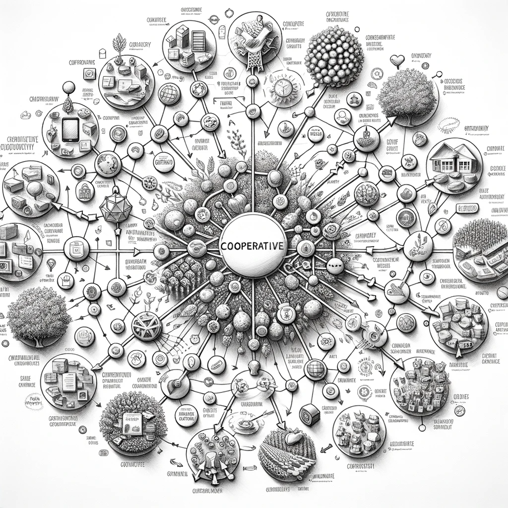
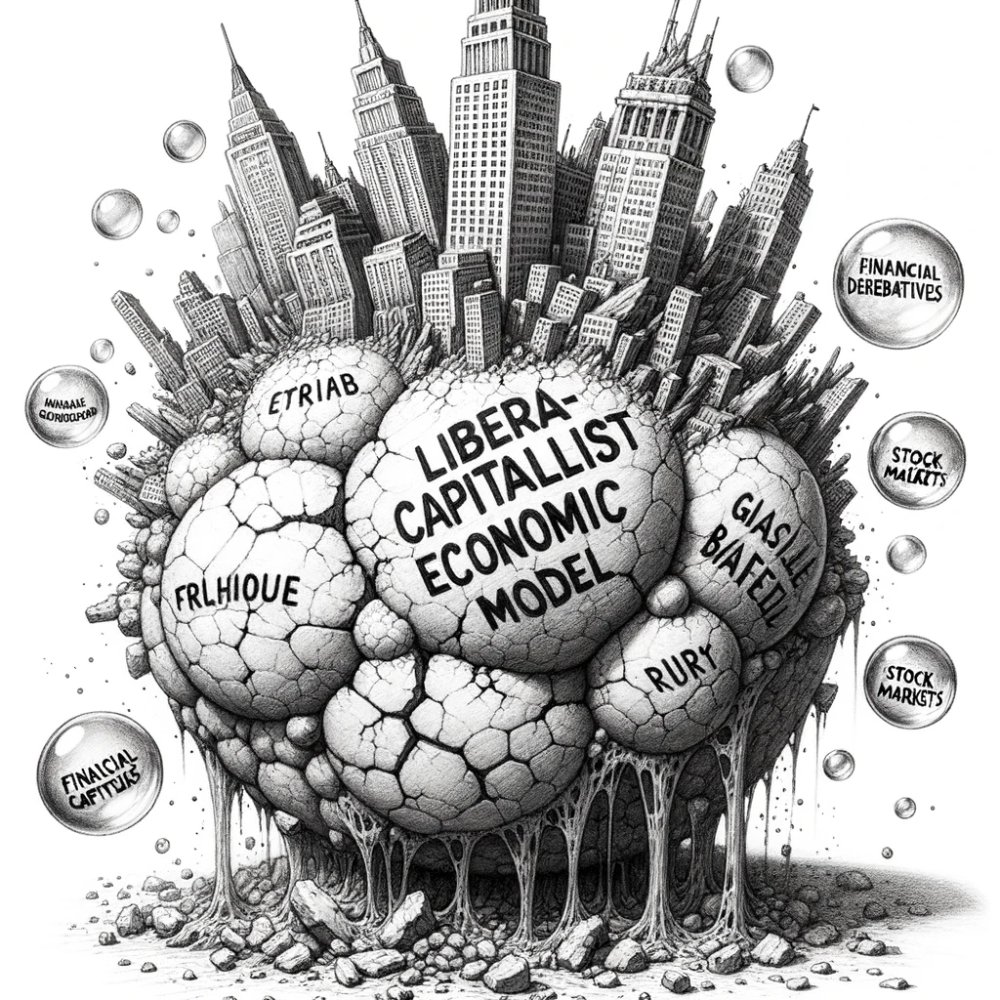
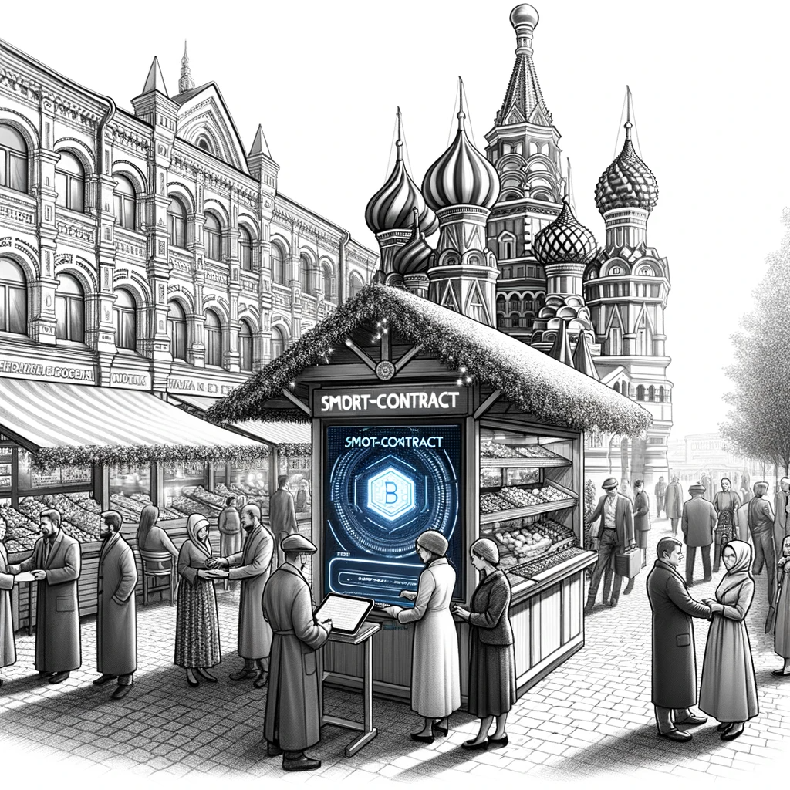
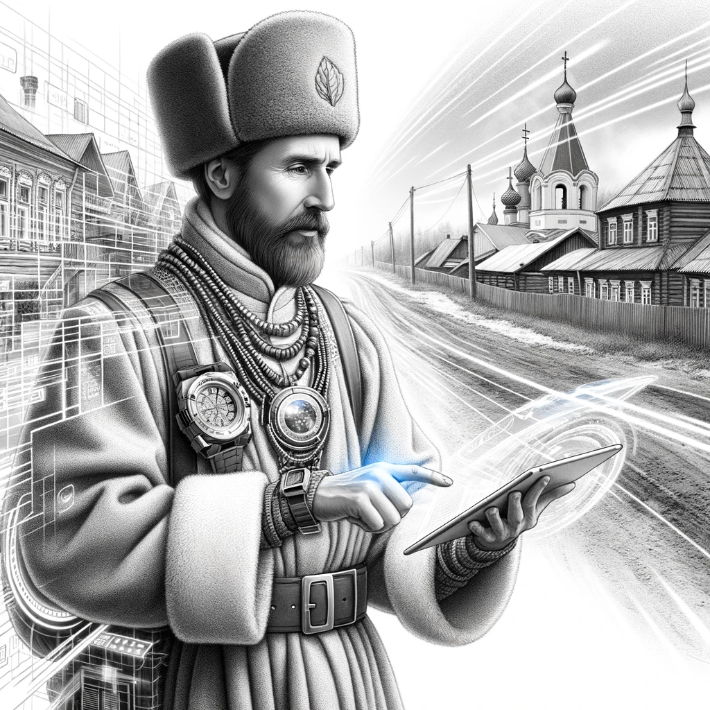
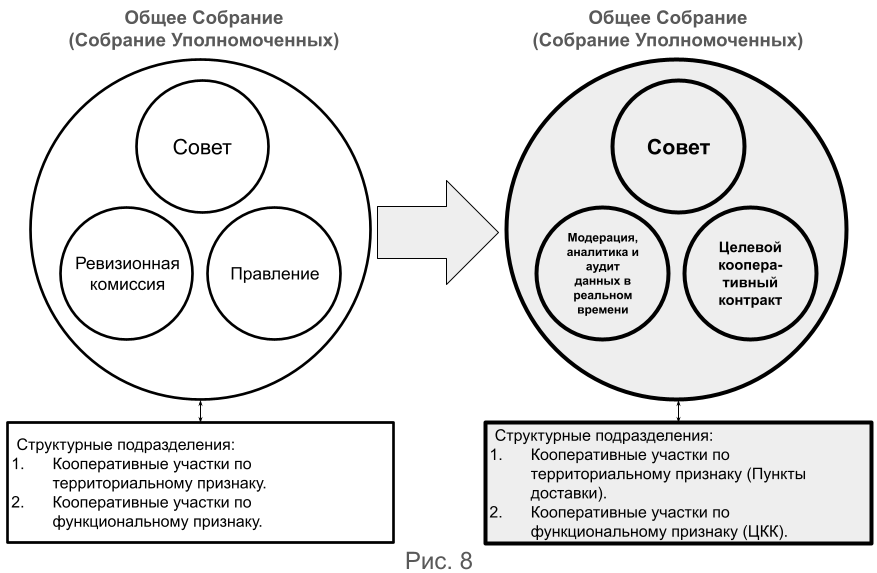
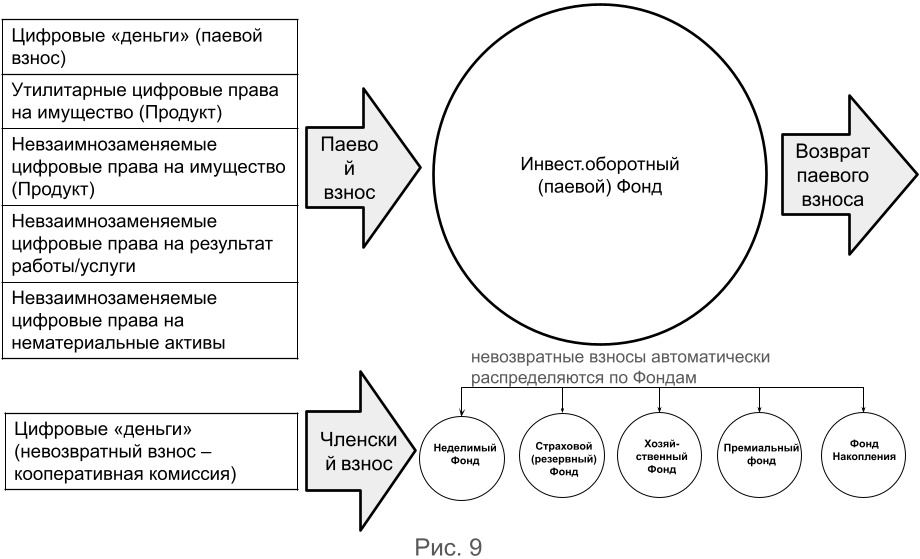
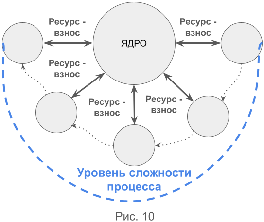
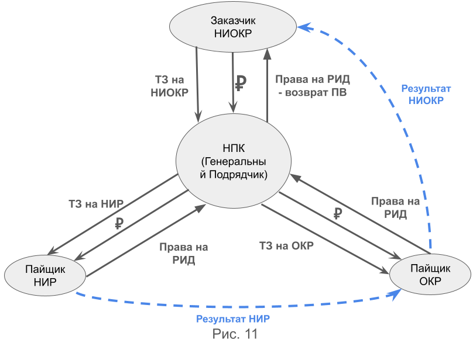
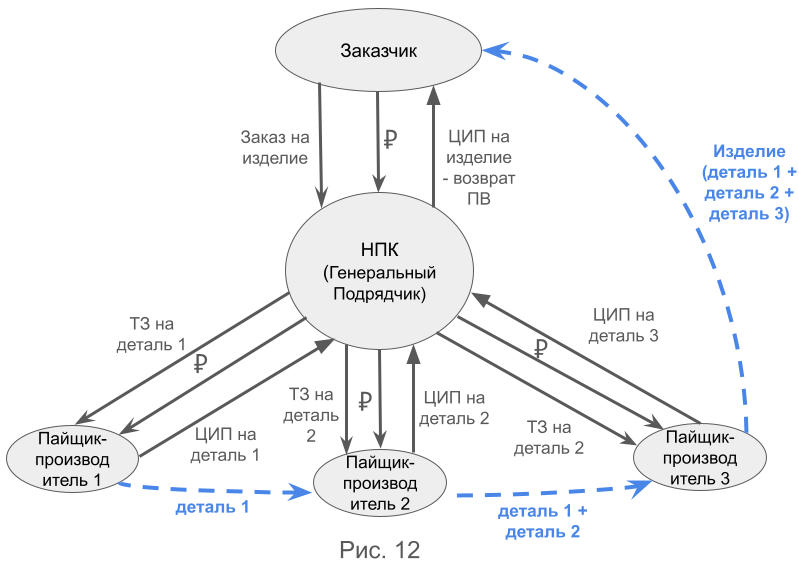

То, что считается “Экономикой” в современном мироустройстве, на самом деле является хрематистикой, причем в ее наиболее уродливой форме. Аристотель в «Никомаховой Этике» определяет экономику, как хозяйствование для "хорошей и благополучной жизни и развития общества". Введя термин “хрематистика”, как вида хозяйственной деятельности, он делит ее на два типа: первый способствует экономике для приобретения ресурсов, которые необходимы, чтобы обеспечить общественное благополучие. Цель же второго, как утверждает Аристотель “ведет к мнению, что нет предела богатству и собственности" [Политика I, 9, 1257a 1] - другими словами, уродливая, эгоистичная, направленная на стяжание и наживу деятельность, в ущерб другим и обществу в целом. 

<figure markdown="span">
  
  <!-- <figcaption>Рис. 1</figcaption> -->
</figure>

Типичный пример хрематистики от Аристотеля, который, мог бы являться позитивным примером из современных учебников по “Экономикс”: «Некий Фалес, предвидя на основе астрономических данных богатый урожай оливок, еще до истечения зимы передал в качестве задатка имеющуюся у него небольшую сумму денег всем владельцам маслобоен в Милете и Хиосе, договорившись по-дешевке, ведь на тот момент конкурентов у него не было. Когда наступило время сбора оливок и сразу многим производителям оливок одновременно потребовались маслобойки, то они вынуждены были выкупать у него время для своих нужд на поставленным им условиях и, Фалес собрал много денег».

В современных условиях, как в России, так и в мире, кооператив - это юридически и традиционно устоявшийся формат хозяйственной деятельности, апробированные практики, методология и регламенты, которые обеспечивают рост общественного благосостояния и справедливое распределение общественных благ. Другими словами, согласно Аристотеля - это, как и есть то, что составляет понятие “Экономика”!

<figure markdown="span">
  
  <!-- <figcaption>Рис. 1</figcaption> -->
</figure>

## Шанс, однако…

Второй раз в нашей истории мы оказались в чуждом нам экономическом укладе. Первый раз - со второй половины 19 века нас постепенно втягивали в него. Кульминацией стали реформы С.Ю. Витте, в результате которых мы, в начале 20 века, практически потеряли и финансовый и промышленный суверенитет. Закончилось все втягиванием России в Первую Мировую войну, 1917 годом и кровавой гражданской войной. 

И этот второй раз мы переживаем и нынче, начиная с 1991 г., когда наша страна, ведомая приватизаторами, была подвергнута разграблению. Этими “стараниями” нас превратили в экономическую колонию Запада, давая последнему шанс поддержать их фактически обанкротившуюся систему еще на 20 лет, выкачивая из России ресурсы.  Собственно, и война, по сути, гражданская, уже тоже идет - одну колонию натравили на другую за непослушание, и, с уже очевидными признаками интервенции.

Но три фактора дают нам уникальный шанс соскочить с “иглы” навязанного нам экономического уклада пока еще усердно поддерживаемого компрадорской частью элит. С учетом анализа ошибок и достижений Прошлого, в том числе и советского времени, анализа тенденций и предпосылок Настоящего, а также возможностей, которые нам открывает Будущее - построить экономический уклад, который соответствует нашей цивилизационной сути, а именно:
нас отключили от институтов пока еще доминирующей либерально-капиталистической системы. Кстати, как интересно: возникла вынужденная сейчас автаркия и, мы тут же видим результат - абсолютно органичное развитие, несмотря на противодействие финансово-экономического блока.

Мы - крупнейшая ядерная держава, благодаря нашим великим предкам, что не позволит разорвать Страну на части, по крайней мере, военным путем извне. Экономика ссудного процента дошла до предельного роста, прекращение воспроизводства капитала привело к слому неолиберальной моноцентричной модели, определился переход в полицентричную модель со смещением от финансового капитала к ресурсному (материальному) росту и регулированию, где доминантной формой организации экономической деятельности становятся горизонтальные интегрированные сетевые структуры, в которых экономическим субъектом становится коллектив. 

<figure markdown="span">
  
  <!-- <figcaption>Рис. 1</figcaption> -->
</figure>

## Не рассосется!

Так почему этот чуждый экономический уклад нам “не заходит”? Тут стоит обратиться к исследованиям Сергея Переслегина о культурных и когнитивных кодах [1]. Наша цивилизационная суть или другими словами - Русский Культурный Код (далее РКК) географически и исторически детерминирован на другое. Среда, в которой исторически формировался наш архетип, имеет свои особенности: холодный климат, короткое лето, низкий прибавочный продукт, огромная территория и расстояния, нет естественных границ, нас давили и давят и с запада и с востока. Именно поэтому конкуренция, свойственная “рыночной” экономике, для нас напрасная трата ресурсов, для достижения целей необходимы сверхусилия, в основном, коллективные. Поэтому нам свойственно хозяйствование и тоже, очевидно, коллективное. Общинность сидит  в нашей подкорке, как залог выживания в агрессивной среде. Мы играем “предельными ставками” в жизни, в работе, в мышлении, и именно поэтому, нематериальные ценности для нас превыше материальных. Соответственно, и неэквивалентный обмен, и ссудный процент  противоречат нашим морально-нравственным императивам, и создают дихотомию. 

Доминантной формой организации экономической деятельности модели капитализма в его текущей стадии - неолиберальной моноцентричной модели, является корпоративизм, в котором индивид является обособленной экономической единицей (предприниматель ли, потребитель ли). Поэтому примат индивидуализма абсолютен. Индивид в доктрине неолиберальной модели должен конкурировать с другими, бороться за “место под солнцем” для себя лично и, если необходимо, то в ущерб другим индивидам. Отсюда и абсолют хрематистики: стяжать для себя богатство, чтобы вознестись и удерживаться в социальной иерархии. __Деньги и финансовое благополучие - мерило успеха и власти.__

Навязанный нам в 90-х “дух капитализма”, основанный на протестантской этике, и такие его “прелести”, как колониальный неэквивалентный обмен - это когда метрополия паразитирует над колонией и выкачивает ресурсы и блага, разнузданное ростовщичество, культ потребления, махровый индивидуализм, которые в корне противоречат нашей цивилизационной сути (РКК), стал основным ударом по нашей стране. Еще со второй половины 80-х происходило намеренное разрушение и общественного формата экономических отношений - ее “артельного духа” или, другими словами, традиционной доменной (общинной) структуры, что ярко отразилось в кооперативах: сначала их превратили в инструмент выкачивания доходов из государственных предприятий, а далее довели до полной дискредитации кооперации, стимулируя навязанную спекуляцию. Однако, окончательно вытравить цивилизационную суть, к счастью, не удалось.

<figure markdown="span">
  
  <!-- <figcaption>Рис. 1</figcaption> -->
</figure>

Проявившаяся за последние пару лет зависимость от Китая, ставшего фактически первой экономикой мира, заставила задуматься, как могла развиваться страна, не будь перестройки и реставрации капитализма. Господство олигархов стало полным разочарованием и привело к потерям большим, чем ВОВ. А противостояние с Западом поставило вопрос: зачем нам модель экономики, заранее запрограммированная на обслуживание чужих интересов, а не своих?

Перелом 90-х сформировал общество “травмы” [2] с неудовлетворенным общественным запросом на социальную справедливость, чудовищное расслоение общества и исключение из общественной жизни 80% населения. Жизнь в навязанной социально-экономической доктрине закономерно привела к перекосу системы: лидирующие экономические субъекты в России, или, как принято говорить, “элита” вообще (за редким исключением) -  это те, у кого, по-сути, цивилизационный сбой - олицетворяют фактор отрицательного отбора. Во всю работает железное правило бюрократии С. Паркинсона  - бюрократический аппарат РФ с 1994 г. увеличился в 2,5 раза, а, к слову, бюджет расходов правительства РФ с 2020 по 2024 г вырос в 2 раза. Углубляется и без того чудовищная социальная поляризация, по данным WID, в 2022 г. 1% самых состоятельных семей РФ владели 47,65% чистых богатств, а 50% бедной части россиян — всего 3,1%. Разница накопленных богатств выросла уже до 764 раз, тогда как при СССР была около 50.

Помимо отрицательного отбора, сама экономическая система в России, подчиненная  чуждому экономическому укладу, основатель которого сам находится в стадии “клинической смерти”, скукоживается и выталкивает лишний “людской балласт” в “никуда”, тем самым пополняя прекариат. 

Отрицательный отбор, отнюдь не только продукт 90-х и первых 15 лет XXI века, когда страна упорно встраивалась в чуждый экономический уклад. Не говоря об очевидных проходимцах, сколотивших приватизационные состояния в 90-х и находящихся в “сливках российского бизнеса” и поныне, достаточно посмотреть на основной контингент выпускников РАНХиГС, ВШЭ, МГИМО, где их обучили по стандартам либерально-капиталистической модели, и, которые пополняют отряд бюрократического аппарата. Если посмотреть на состав активистов разных институтов развития - АСИ, Сколково, то они до сих пор не стесняются публично продвигать идеи либерально-финансового дарвинизма.

“Главный принцип их неолиберальной модели состоял в том, что экономический рост и развитие зависят от рыночной конкурентоспособности и нужно сделать все для максимального повышения соревновательности и конкуренции так, чтобы рыночные принципы проникли во все аспекты жизни. Считалось, помимо всего прочего, что следует повысить гибкость и подвижность рынка труда, а это значило переложить бремя рисков на плечи работающих и их семей, делая их еще более уязвимыми. В результате возник класс мирового «прекариата», насчитывающий в разных странах много миллионов людей, не имеющих якоря стабильности. Они-то и стали новым, потенциально опасным, классом [3]. 

<figure markdown="span">
  
  <!-- <figcaption>Рис. 1</figcaption> -->
</figure>

СВО и мобилизация в военном сегменте (Армии и ВПК) несколько сбавила остроту, создав эмоциональный патриотический подъем в Обществе. Риторика Главы Государства о новой элите, которую составят герои-участники СВО, создала дополнительный энтузиазм в отношении давно созревшего в обществе запроса на справедливость. Обозначенные, в рамках этой риторики, программы действительно нацелены на создание ”социальных лифтов” для участников СВО, однако сложившаяся система во властных группах влияния, скорее, в очередной раз, трансформирует “Сон Бальзаминова” в точечное включение отдельных ветеранов в “элиту” для создания очередного пиар-эффекта.  А Business as usual в гражданских секторах экономики и социальной сфере, накопленные проблемы “общества травмы” и внушительная масса прекариата (не менее ⅓ трудоспособного населения), заставляют вообще с крайней опаской относиться к сложившейся ситуации. Сформировались прекарные сообщества и анклавы, нередко весьма агрессивные. Прекарные сообщества в социальных сетях часто трансформируются в секты оккультного и эзотерического толка, что приводит к потере рационального восприятия жизни и постоянному стрессу. А это, в свою очередь, разрушительно для института семьи! О каком тогда демографическом подъеме можно говорить в таких условиях? Можно сколько угодно объявлять “годы Семьи”, вливать средства в льготную ипотеку и “материнский капитал”, красиво отчитываться за потраченные ресурсы, но без создания условий вовлечения в социально-экономическую деятельность прекариата демографическая ситуация с коренным населением будет только ухудшаться.

Есть, как ни парадоксально, и позитивная сторона наличия прекариата в России, которая нуждается в экономической институциализации. И дело снова в особенности нашего архетипа, нашей цивилизационной сути - общинности как фактора выживания. Стихийно сформировались домены - группы людей “идущих по жизни” вместе, но оказавшихся в нестабильном (прекарном) состоянии. Для них система, которая их “вытолкнула”, является, своего рода, агрессивной средой. Это и неформальные “бригады”, формирующиеся из бывших коллег-друзей, земляков, диаспор, соседей, которые совместно промышляют в разных сферах, оставаясь в “теневом” секторе, иногда, надо отметить, и с криминальным оттенком. Ну, а бытовая экономика - вся прекарная. 

## Назад в будущее

<figure markdown="span">
  
  <!-- <figcaption>Рис. 1</figcaption> -->
</figure>

Часто мы слышим призывы к срочному реформированию Российской экономики и финансовой системы на основе модели сталинского периода (1929-1955 гг.), как наиболее успешного примера экономического роста. Многие из ее элементов, начиная от государственной монополии внешней торговли, государственного валютного регулирования, директивного планирования, и заканчивая системой распределения и налогообложения - все это, безусловно то, что необходимо для экономического благополучия страны. Но самым важным было то, что сталинская модель создала собственную систему разделения труда, выраженную в наличии социалистического лагеря, СЭВ. Другими словами, она не была встроена в “чужую” систему разделения труда. 

Очевидно, что просто повторить не получится - другой исторический период, другой технологический уклад. Хотя предложенные варианты использования некоторых подходов сталинской экономики[4], видимо, могут исправить текущую ситуацию и с большой вероятностью принесут некоторый эффект. Однако, без выстраивания собственной системы разделения труда, со своей стратегией и переходом в такую экономическую модель, которая бы соответствовала нашей цивилизационной сути, создания собственной экономической школы, этот эффект снова окажется временным, а история это доказывает.

Суть сталинской экономики базировалась на идеологии, государственном планировании, в которую входили межотраслевой баланс, прибыли от роста производительности труда и сокращения издержек, и жестком регулировании, вплоть до регулируемой рентабельности за счет подвижного элемента - налога с оборота на предприятиях его производящих. Несмотря на бесспорные в т.ч. и социальные достижения, тем не менее, сталинская экономика, хоть и дошлифованная под идеологию “социализма”, в своей теоретической основе оставалась все той же экономикой ссудного процента или капиталистической экономикой, постулированной классической английской политэкономией А.Смита и Д. Риккардо, и положенной в основу Марксизма-Ленинизма.

И вот тот самый урок истории - сталинская экономика и экономическая стратегия мгновенно свернулись как только умер Иосиф Сталин - ее идеологический базис был подорван “хрущевской слякотью”[5], стратегический курс -  переходом к мирному сосуществованию с капитализмом[6] (сиречь встраиванием в  международную систему разделения труда, которая базировалась на Бреттон-Вудских соглашениях) и добита реформами Косыгина-Либермана. Прочность  фундамента сталинской экономики оказался ненадежным, поскольку базировался изначально на лукавстве К. Маркса, а сформулированной экономической школе, которая бы впитала весь практический опыт и наработки того времени, просто не дали состояться.

## Банки и мазохизм

<figure markdown="span">
  
  <!-- <figcaption>Рис. 1</figcaption> -->
</figure>

Банкиры, легализованные в 17 веке в своей ростовщической сущности - торговле деньгами через кредит и связанный с ним ссудный процент, подмяли под себя и финансовую сферу, в т.ч. такую необходимую деятельность как денежное обращение, расчетно-кассовое обслуживание, создав ассоциативный ряд в когнитивной цивилизационной парадигме. Таким образом, закрепив в сознании, нормальность и, якобы, “естественность” ростовщической сути денежно-финансовой сферы, она оказалась, как бы спрятанной за понятными и необходимыми функциями, которые объективно востребованы в сфере экономики. 

Ранее мы писали, что банк - в корневом смысле это  стол, прилавок, за которым в древние времена денежные менялы занимались спекуляциями и ростовщичеством. Порицание этой деятельности в авраамических религиях было неслучайным - злоупотребление деньгами как экономическим ресурсом всегда приводило к неблагоприятным последствиям для хозяйства, т.е. вредило остальным экономическим субъектам, и поэтому считалось грехом. Возведение же злоупотребления в обиходное экономическое правило, соединило такие полезные функции банкинга как субъекта денежного обращения, расчетно-кассового обслуживания и такое, как-бы “необходимое зло” - паразитические функции денежного спекулянта и ростовщика.

???+ note "Евангелие от Матфея, глава 21, стихи 12-13"

    И вошел Иисус в храм Божий и изгнал всех продающих и покупающих в храме, и столы менял и скамьи продающих голубей переверг. И говорит им: написано: "Дом мой дом молитвы наречется", а вы делаете его вертепом разбойничим."

Исходя из консервативного представления о природе и функции денег в экономике, никто не оспаривает общепринятого взгляда на деньги как средство обращения, меру стоимости и средство сбережения. Традиционная марксистская политэкономия определяет деньги, как товар и, если функция “Товар-Деньги-Товар” логична и справедлива, то функция “Деньги-Товар-Деньги’ (штрих) ” - уже вызывает, мягко говоря, сомнения. Деньги - это  механизм или, если угодно, “социальный институт”, “экономическая абстракция”, созданная для обслуживания хозяйственных потребностей общества;  служебный, технический инструмент, не имеющий полноценных товарных свойств. Преобразование денег в капитал, то есть в фактор производства, претендующий на ренту, требует, чтобы обладатель денег был подвержен риску некомпенсируемой потери. То есть получение ренты оправдано, если обладатель денег принимает предпринимательский риск! Фиксированное же и гарантированное вознаграждение в сложившейся банковской практике - ссудный процент - это воплощение роста финансового (ростовщического) капитала - основы неэквивалентного обмена, порабощения и власти ростовщиков. И это не про рост производства или благосостояния общества, а про рост благосостояния лишь кучки ростовщиков. А как известно, лежащий в основе капиталистической экономики ссудный процент неизбежно приводит к пределу этого самого роста, создавая кризисы. 

Поначалу паразитарная доля банковских институтов в объеме экономики была незначительная и, вплоть до конца 50-х годов 20 века составляла не более 5% ввиду экспансивного роста колониальной капиталистической системы. Но, как только пределы расширения естественным образом закончились, банковский и, в целом, финансовый сектор увеличили свою долю до 75%. Если сравнивать с человеческим организмом, то эта “раковая опухоль” поглотила его практически целиком, накопив “гнилой баланс” долгов в 35 триллионов долларов США. 

Таким образом, если раньше, при небольшой доле банковских институтов в экономике, их полезность еще можно было бы аргументировать - доля паразитарной составляющей была сравнительно невелика, то сейчас уже о пользе говорить не приходится.

В России банковский сектор регулярно перекачивает себе практически всю прибыль экономики, обескровливая предприятия материального производства. Возврата в экономику этих сконцентрированных капиталов не происходит, в том числе и благодаря политике ЦБ РФ с необоснованно драконовской ключевой ставкой для “таргетирования инфляции” - они, через спекулятивные операции банков на бирже, прирастают и распределяется в виде дивидендов и, в своей существенной части, успешно вывозятся в “недружественные” юрисдикции. И это, как показывают события последнего десятилетия, полностью устраивает кланово-бюрократический класс, который, за редким исключением, видит свое будущее исключительно вне России.

Планы перехода в цифровые валюты - CBDC - под патронажем Банка международных расчетов - помимо ужесточения финансового рабства, достигнутого доселе уже изощренными ростовщическими механизмами, является планом по перезагрузке мировой финансовой системы на новых технологиях, чтобы закрепить свое доминирование. 

## Целеполагание 

Важнейший элемент экономической политики государства и деятельности экономических субъектов - это целеполагание. Именно в нем и содержится ответ на вопрос, а зачем, собственно, функционирует экономика, какова ее цель? А сейчас она запрограммирована как раз на ценности, которые были нам навязаны в 90-х. Даже государственные корпорации в России, не говоря о частных, сегодня имеют базовую уставную цель деятельности - извлечение прибыли. Не про “социальное государство” речь, как указано в Конституции РФ [7], что очевидно указывает на приоритет общественного блага и удовлетворение потребностей общества, а прибыль! В ГК РФ и других законах регулирующих предпринимательскую деятельность прямо указано, что предпринимательская деятельность направлена [цель - авт.] на систематическое получение прибыли [8]. 

Главным критерием для принятия экономических решений является стремление к увеличению капитала, а принятие решений строится на величине капитала - у кого больше, тот и прав. А между тем, "Прибыль капиталиста получается оттого, что он может продать нечто, чего он не оплатил. Прибавочная стоимость, прибыль, состоит как раз из избытка стоимости товара над издержками его производства, т.е. из избытка всей суммы труда, содержащейся в товаре, над содержащейся в нем оплаченной суммой труда" [9]. Другими словами, это и есть неэквивалентный обмен, апологетика ссудного процента, индивидуального обогащения и источник социального неравенства и расслоения.

Единственный в России формат экономической организации, который предполагает обеспечение потребностей общества как свою базовую уставную цель, соответствующую и Конституции РФ - это кооперация (в текущем Российском законодательстве речь идет, прежде всего, о Потребительской кооперации - ФЗ 3085-1 от 19.06.1992 г.), где управляет не капитал, а человек (1 пайщик - 1 голос), где обогащение приобретает свой истинный смысл: общественный достаток духовных (интеллектуальных, культурных) и материальных благ. 

Построенная на методологии потребительской кооперации модель “Кооперативной экономики”, с приматом общественного над индивидуальным, способствует восстановлению матрицы ценностей, присущей Русской цивилизационной сути (РКК), способ переноса людей, общества в целом в нормальную ценностную матрицу и получения не только иммунитета от манипулирования инстинктами “страха за кошелек” со стороны адептов социально - западной экономической парадигмы (провокации с “зеленкой” - как недавний пример на выборах Президента РФ 16-18 марта 2024 г.), но победить в войне смыслов и создать привлекательный образ будущего нашей страны.

## Основа экономического чуда

Не случайно еще в начале 19 века экономика в российских образовательных учреждениях изучалась в разделе “Этика”. В общинно-религиозном общественном сознании отношения экономических субъектов должны были строиться на основе честности и доверия. “Слово купеческое” - не просто часть фольклора и литературного наследия. Российское купечество произрастало корнями из староверов, что и предопределило соответствующий отражение как в традиции, так и в русском когнитивном коде.  

Этический кодекс старообрядчества требовал честного труда и ведения дел, ответственности перед обществом. Купец-старовер был убежден, что он выполняет свое религиозное предназначение, что его деятельность «спасет его душу», что «делать благие дела» (определение которых распространялось на духовные занятия, физический труд и «купеческое дело») нужно при жизни, чтобы подготовить спасение бессмертной души[10]. Все это полностью резонирует с Исламской экономической доктриной и еще раз подтверждает, что этические принципы классического Ислама и истоков Православия совпадают.

<figure markdown="span">
  
  <!-- <figcaption>Рис. 1</figcaption> -->
</figure>

Община  - основная единица социальной структуры старообрядцев. Община строилась на коллективной ответственности, как в положительном смысле, так и в отрицательном: и заслуги общие, и убытки общие. Но зато такую общину труднее давить, она, за счет существующих горизонтальных связей, не поддается. Ее члены были застрахованы от серьезных экономических неудач: если какой-то сектор экономики приходил в упадок, то это компенсировалось средствами более удачных предприятий внутри общины. Более того, она выполняла функции банка или кассы взаимопомощи - многие старообрядцы получали первый стартовый капитал (без ссудного процента) от общины, не прибегая к внешним займам[11]. 

Купцы-старообрядцы, чьи фамилии “на слуху”- Рябушинские, Рахмановы, Кузнецовы, Морозовы и пр., были, своего рода, “авторитетами” старообрядческих общин и держателями таких банков - “общаков”.

За счет сильной горизонтальной организации старообрядческий уклад оставался невероятно жизнеспособным.  Исчерпав к началу XIX в. все формы религиозного, политического противостояния с государством, чтобы выжить и сохраниться, старообрядчество превратилось в могучую конфессионально-экономическую общность, которую на равных составляли общинные хозяйства (артели) и формально частные предприятия членов общин, со своим этическим кодексом - императивом возвращения части прибыли в общину и направления средств на благотворительность. К началу 20 века в руках староверов было сосредоточено около 64% российского национального  капитала. Составляя в общей численности населения около 1,5%, они дали России свыше 2/3 всех предпринимателей-миллионеров в то время, когда страна выходила на первое место по темпам экономического развития в мире. 

Собственно, кооперативное движение в дореволюционной России и строилось, в основном, на старообрядческих артелях, держась особняком в международном кооперативном движении, которое изначально встраивалось в экономику ростовщиков (неслучайно, что основные их успехи были в кредитной кооперации - Raiffeisen, Credit Agricole, а не сельскохозяйственные, заготовительные и промысловые артели, как в России). И когда артели и кооперация в целом начали активно развиваться в конце XIX века, и вышли за рамки старообрядческих общин, потребовалась формализация основных принципов доверия и этических норм, которые переросли в обычаи кооперативного документооборота. С тех пор и начала развиваться кооперативная “бюрократия”, в которую стали внедряться основные принципы горизонтальных экономических связей, складывая их в стройную систему. В дальнейшем, эта система во многом была унаследована и советской кооперацией, что и способствовало ее успешности как одного из ключевых элементов сталинского мобилизационного рывка в 1929-1955 г., хорошо описанного в книге “Кристалл роста. К Русскому экономическому чуду”[12].

Таким образом, справедливо считать, что артельная (общинная) экономика, построенная на этических принципах староверов, явилась отнюдь не меньшим “экономическим чудом” в Российской истории. 

## Доверие и бюрократия

<!-- 

 -->

Современное российское законодательство по кооперации также, во многом, унаследовало систему кооперативного документооборота. И если нравственно-этические нормы предпринимательства, заложенные староверами, серьезно деградировали под влиянием чуждого экономического уклада, а с середины 80-х прошлого века “артельность” общества целенаправленно разрушали насаждаемыми идеологемами западной экономической модели, то система, выраженная в нормах современного законодательства, удивительным образом осталась, как основа для воссоздания полноценной экономики доверия. 

“Бюрократия” кооперации в настоящее время выражена в документировании каждой кооперативной сделки, каждого коллегиально принимаемого решения или согласования. Кооператив, согласно законодательства РФ, помимо Устава, принимает детальные правила и регламент взаимодействия со своими участниками (пайщиками), использованию средств и имущества, обеспечения деятельности, проведения собраний, контроля и пр. Каждое взаимодействие (трансакция между кооперативом и пайщиком) тщательно документируется по формуле: инициатива/коллективное согласование/решение-оформление, создавая ворох первичной документации, требующей особо квалифицированного бухгалтерского сопровождения. И это еще и на фоне запутанности и противоречивости в законах РФ и различных распоряжений регуляторов.

В отличие от регламентов и форм западной модели, предполагающей вертикальную организацию, а не горизонтальную, как в кооперативной среде, такой механизм создания первичных документов на физических носителях и с обязательным визированием со стороны всех участников коллективных решений и согласований, создает барьер как для масштабирования самой организации, так и для оперативности реагирования на возрастающую динамику изменений в экономической среде и периодическое “творчество” фискальных регуляторов. К этому надо добавить то, что методология делового администрирования в кооперативе требует отдельной профессиональной подготовки, спрос и доступность которой сильно деградировали в постсоветское время. Не говоря уже о том, что переход на кооперативное (общинное) мышление в предпринимательской деятельности требует серьезного переосмысления уже ставшего привычным, ведь 40-летнее стимулирование стяжания денег, как мерила успеха, даром не прошло… 

Другими словами, конкурентоспособность кооперативной модели сильно ограничена вышеописанными обстоятельствами, если бы не одно “но”… и это - цифровизация.  Переход в новый информационный технологический уклад позволяет снять все барьеры для развития кооперации: масштабировать деятельность без ограничений, оперативно реагировать на события в экономической среде, быстро принимать коллективные решения, достичь скорости кооперативных сделок, аналогичной той, с которой совершаются сделки в текущей экономической среде. И самое главное - цифровые решения позволяют выстраивать строгие математические алгоритмы администрирования деловых процессов в соответствии с этическими нормами коллективного хозяйства (экономики доверия), загоняя сложные конструкции кооперативной методологии “под капот” и создавая среду цифровых сервисов на основе уже привычных для пользователей паттернов.

Поскольку трансформация мирового экономического хозяйства в виртуальную цифровую экономику уже фактически произошла, цифровая экономика стала управляющей по отношению к экспоненциальной экономике физического мира. Она определяет основные товаропотоки, сделки по которым совершаются в виртуальном пространстве – на маркетплейсах, цифровых торговых площадках и т.д. Логистика физических товаров, в свою очередь,  контролируется также посредством информационных систем. С появлением технологии распределенного реестра возникли новые форматы дистанционных сделок с виртуальными товарами и цифровыми двойниками людей и вещей. Появились новые понятия и новые возможности для возрождения кооперации. 

Таким образом, в Кооперативной Экономике возникает оборот цифровых имущественных прав (ЦИП) или утилитарных цифровых прав на имущество, включая денежные средства, которые участвует в кооперации. Администрирование же этого процесса осуществляется автоматизировано на уровне информационной системы регистрации юридических и финансовых событий. Данные о таких событиях сохраняются в системе распределенного реестра. Эта технология сегодня является передовой с точки зрения безопасности доступа и хранения данных. Аналогично и с процессом принятия коллективных решений, теперь не нужно проводить очные встречи и собрания, достаточно организовать онлайн встречу и процедуру заочного дистанционного голосования с сохранением результатов в системе распределенного реестра. Это существенно снимает барьеры для развития кооперации в цифровой экономике.

Помимо снятия барьеров развития кооперации, цифровизация позволяет сконцентрировать в себе и полезные функции банков для участников кооперации: кассы взаимопомощи с расчетно-кассовым обслуживанием, агрегацию фондов развития, страхования, пенсионного обеспечения, организацию беспроцентных ссуд на развитие предпринимательских инициатив своих членов. 

Тут, видимо, уже пора дать определение Кооперативной Экономике, что это такое и как авторы ее понимают и представляют. Кооперативная Экономика - это хозяйственный уклад, основанный на традиционных нравственных императивах, общественном управлении, коллективной собственности, равенстве экономических субъектов и эквивалентном обмене, воплощенный в сетевом цифровом формате.

Ее цель -  создание полезного и необходимого общественного продукта (обеспечение материальных и иных потребностей общества), а не извлечение и максимизация прибыли. Главная цель кроется в “иных” - возрождение духовно-нравственных императивов в соответствии с русской (в широком значении) цивилизационной сутью и традициях, в целом общих для консервативных течений авраамических религий (Православие, Ислам, Иудаизм).

## Погружаясь в “кроличью нору”

Надо отметить, что представленные механизмы потребительской кооперации, выросшей в своих методологических основах из наследия предпринимательской культуры царской России XIX века, где превалировала этика старообрядцев, многократно апробированы на практике за последние пару десятилетий. Результаты такой практики, опыт ошибок и успехов, в основном, прошли мимо широкого круга экономических субъектов и делового сообщества по причинам, которые мы подробно описали в предыдущей статье “Кооперативная Экономика - Назад в Будущее”. 

## Ядро клиринга и финансово-инвестиционный механизм

Потребительская кооперация в ее некоммерческой ипостаси, помимо проработанной за десятилетия методологической основы, в отличие от других видов кооперации - производственной, кредитной, сельскохозяйственной, жилищно-строительной, регулируется только Законом о потребительской кооперации [13], ГК и, в общем порядке, НК РФ. Другие ограничения деятельности, кроме напрямую запрещенных законодательством, отсутствуют. Это - замкнутый экономический контур, функционирующий как имущественный клиринг (деньги ведь - тоже имущество!), только в ограниченном круге лиц - участников (пайщиков),  которые сами, в рамках Закона о потребкооперации, определяют правила и регламенты их взаимодействия с кооперативом, таким образом, обособляясь от юрисдикции, регламентов и правил экономики ростовщиков [14] и осуществляя эквивалентный обмен. При этом, какие-либо ограничения по количеству пайщиков, их правовых форм и юрисдикции отсутствуют [15]. 

В некоммерческом формате потребкооперации продажи (в их юридическом и фактическом понимании) нет. Все взаимодействие между пайщиками и кооперативом происходит только через имущественные взносы: паевые - безусловно возвратные и членские - невозвратные. Паевые взносы формируют складочный капитал кооператива - Паевой Фонд, который используется для обеспечения потребностей пайщиков, через возврат их взносов тем имуществом, которое ими востребовано тут и сейчас [16]. Другими словами, Паевой фонд - это подвижный оборотный механизм, который имеет абсолютную инвестиционную природу - инвестиция (паевой взнос) и возврат инвестиций (возврат паевого взноса). Членские (невозвратные) взносы являются способом поддержки операционной деятельности и устойчивости кооператива, размер которых определяется пайщиками - совладельцами кооператива - и направляются на фонды кооператива. Совокупно паевые взносы и их возврат и членские взносы составляют финансово-инвестиционный механизм клиринга некоммерческой потребительской кооперации, который работает, как показано на Рис.1.

<figure markdown="span">
  
  <!-- <figcaption>Рис. 1</figcaption> -->
</figure>

Часто, люди поверхностно знакомые с потребительской кооперацией, говорят, что потребительские кооперативы не платят налогов и, это, дескать, не выгодно как  государству, так и обществу, а государство вот-вот прикроет эту “лавочку”... 

Во-первых, это относится только к потребительским кооперативам в некоммерческом формате. Тут нужно отметить, что коммерческий отличается от некоммерческого тем, что первый взаимодействует с неограниченным кругом лиц, т.е. использует все институты государства, как регулятора, в своей деятельности, и поэтому платит все причитающиеся законодательством налоги в сделках купли-продажи. Второй же, взаимодействует только с ограниченным кругом лиц - своими пайщиками, которые сами регулируют свои взаимоотношения внутри кооператива, где отсутствуют отношения купли-продажи, а деятельность ведется только через взносы и их возврат.

Во-вторых, некоммерческие потребительские кооперативы (НПК) налоги вообще-то платят, за исключением оборотных - на прибыль (нет продажи, нет и прибыли!), социальные, и то, только при отсутствии наемных работников, и НДС. Имущественные налоги остаются обязательством НПК к выплате (правда, некоторые субъекты федерации предоставляют льготы), а доходы пайщиков в НПК (в виде невозвратной материальной помощи) налогооблагаемы по ставке НДФЛ. НПК не субъект для выплаты НДС, поскольку формально, как правило, является налоговым агентом по упрощенной системе налогообложения (УСН), независимо от количества пайщиков и объема оборотов по взносам.

НПК, исходя из действующих регламентов регулятора (ЦБ РФ), не может воспользоваться действующими источниками финансирования в принципе - не может получить кредит, не может выпустить свои ценные бумаги на финансовом рынке и пр. Привлечение средств может быть только в результате взаимодействия с пайщиками и, по их поручению, а средства могут аккумулироваться на фондах кооператива с целью их дальнейшего коллективного использования. Другими словами, государство никак, с точки зрения экономической деятельности, не вмешивается в дела НПК [17], но и не помогает. Ни напрямую, ни через регулируемые им институты. Засим, ни юридического, ни экономического обоснования взимания с НПК оборотных налогов, вообще-то, нет.

Участники же НПК, как физические, так и юридические лица, независимо от правовой формы и юрисдикции - полноценные налоговые агенты. При этом, надо отметить, что они, в известной степени, ущемлены в доступе к источникам финансирования. Для крупных компаний и предприятий привычных правовых форм и индивидуальных предпринимателей кредитная ставка имеет запретительный характер,  а для производственных и сельскохозяйственных  кооперативов кредитование, как и фондовый рынок, практически недоступны. Субсидии же для сельскохозяйственных кооперативов уже стали “притчей во язытцах”, ввиду сложности получения и отчетности по ним, да и по размеру тоже. Для кооперативов, есть только возможность оставаться в УСН, независимо от оборота и количества пайщиков, и осуществлять распределение доходов через трудовое участие пайщиков без социальных выплат. В сталинской экономике, к слову, льготное кредитование и субсидирование коллективных форм хозяйствования было на высоте [18]. Но и налоги за это честно платили.

Чтобы лучше понять как работает имущественный клиринг некоммерческой потребкооперации, нужно умозрительно представить себе следующую картину (Рис.2):

<figure markdown="span">
  
  <figcaption>круглый Стол (кооператив), за которым сидят Игроки (пайщики). Это их Стол - общий. Каждый из них выкладывает на Стол, то, что у него есть - любое имущество (в самом широком понимании) - имущество сразу начинает принадлежать Столу. В отношении имущества, которое на Столе, Игроки - владельцы Стола, коллегиально определяют эквивалент каждой его единицы, сопоставляют стоимости и, согласно эквивалентной стоимости, каждый забирает со Стола то, что ему востребовано, согласно стоимости имущества, которое он изначально положил на Стол. При этом, каждый из Игроков оставил на Столе “чаевые”, чтобы этот Стол дольше служил Игрокам. А еще за этим Столом можно (и тут Закон РФ не запрещает!) использовать “фишки” вместо такого имущества, как деньги…</figcaption>
</figure>

Клиринговый (финансово-инвестиционный) механизм некоммерческой потребительской кооперации полноценно применим и органичен для таких сфер деятельности, как сбор и аккумулирование средств для инвестирования (аналог crowdinvesting), оптовая и розничная поставка и приобретение (аналог оптовой торговли и ритейла), коллективное и индивидуальное пользование имуществом (аналог аренды и лизинга), защита активов, капитализация и защита интеллектуальных  авторских прав. 

Однако для полноценной Кооперативной Экономики, которая бы охватывала все виды деятельности, только формата некоммерческой потребительской кооперации недостаточно ввиду следующих факторов: 
    1. Отсутствия рациональной возможности как учета трудового участия пайщиков, так и распределения результатов трудовой деятельности в широком масштабе, что затрудняет использовать формат некоммерческой потребкооперации в сфере производства;
    2. Необходимости реализации излишков продукции за периметр кооперативного контура.

Чтобы Кооперативная Экономика могла охватить все сферы предпринимательской деятельности, в замкнутый экономический контур должны быть включены и другие юридические формы, которые могли бы выполнять производственные и коммерческие функции, при этом, являясь полноценными участниками и пользователями клирингового механизма - т.е. просто стать пайщиками некоммерческих потребительских кооперативов, объединенных в единую экосистему.

Другими словами, клиринговый механизм некоммерческой потребительской кооперации и ее инвестиционная природа являются объединяющим ядром Кооперативной Экономики по причине совокупности юридических и методологических факторов, способствующих наиболее эффективному взаимодействию с неограниченным количеством ограниченного круга лиц (пайщиками). 

## Механизм управления

“Потребительское общество (кооператив) - это добровольное объединение граждан и (или) юридических лиц… на основе членства путем объединения его членами имущественных паевых взносов…в целях удовлетворения материальных и иных потребностей его членов.” [19]  Каждый член кооператива (пайщик) участвует в управлении, формируя высший орган управления - Общее Собрание Пайщиков - по принципу “один пайщик - один голос” (Рис.3). То есть, решения принимаются не большим количеством долей или акций (размером капитала), а большинством голосов пайщиков прямым участием в голосовании, что полностью соответствует общинному или артельному принципу управления. 

<figure markdown="span">
  
  <figcaption></figcaption>
</figure>

Пайщики кооператива, таким образом, выбирают другие органы управления (Рис.4): 

<figure markdown="span">
  
  <figcaption></figcaption>
</figure>

Совет, его Председателя и Ревизионную комиссию, которые подотчетны Общему собранию пайщиков. Совет, как коллегиальный представительный орган управления кооперативом между общими собраниями пайщиков, назначает исполнительный орган - Правление кооператива и Председателя Правления, которые ему подотчетны. Но есть интересный нюанс. Председатель Совета кооператива, помимо координации деятельности Совета является единоличным исполнительным органом кооператива и действует от его имени без доверенности, также как и Председатель Правления. Другими словами, в кооперативе два единоличных исполнительных органа - Председатель Совета и Председатель Правления, где, как правило, у Председателя Совета полномочий больше.

Прямое участие в голосовании на Общих собраниях может трансформироваться в опосредованное, управленческая модель кооператива значительно меняется и, это происходит при появлении в кооперативе его территориальных или функциональных подразделений - кооперативных участков (КУ). 

КУ формируются пайщиками кооператива, которые приняли решение обособиться в своей деятельности либо территориально, либо по функциональному признаку, выбрали Председателя КУ и определили его местоположение. Совет кооператива, который рассматривает подобные инициативы, согласовывает создание КУ, руководствуясь, как целесообразностью, так и соображениями общей численности пайщиков в кооперативе: при их критическом количестве, которое может затруднить собрание пайщиков в очном режиме для принятия необходимых кооперативу решений.  

Несмотря на довольно привычную семантику (“подразделение”), в действительности, кооперативный участок является уникальной сущностью в предпринимательских управленческих конструкциях в РФ. Во-первых, это степень автономности - Председатель КУ представляет кооператив по доверенности от Председателя Совета, может иметь свой расчетный счет и печать. Но самое главное, он становится уполномоченным - т.е. пайщики КУ передают ему свое право голосовать на Общих Собраниях (но уже не пайщиков, а уполномоченных) - Рис.5. И теперь уже Председатель КУ проводит Общие Собрания пайщиков (но не кооператива, а КУ), где пайщики КУ выбирают своего Председателя. Кооператив, таким образом, превращается в совокупность кооперативных участков.

<figure markdown="span">
  
  <figcaption>Рис.5. И как же это все похоже на горизонтальную структуру конфессионально-экономических старообрядческих общин!</figcaption>
</figure>

Таким образом, КУ представляет собой  механизм масштабирования, территориальной и функциональной экспансии Кооперативной Экономики (Рис.6).

<figure markdown="span">
  
  <figcaption>Рис.6</figcaption>
</figure>

Для примера: Описанная выше система управления и масштабирования НПК, как уже упоминалось, является уже практически апробированной моделью для развития локальных экономик и обеспечения сбыта для местных производителей и обеспечения населения как продуктами питания, так и другими категориями товаров народного потребления местного (локального) производства. Имеется ввиду, что на базе кооперативных участков и в рамках правил и регламента единой целевой потребительской программы (ЦПП), создается единая сеть “столов заказов”, где потребители пайщики кооператива. Поставщики, при этом, могут быть и пайщиками НПК (что выгоднее для них, поскольку их оборот с кооперативом не налогооблагаем), а могут оставаться и продавцами. В семантике современных рыночных реалий по аналогии с OZON, Wildberries и Яндекс-маркета - “столы заказов” это - ПВЗ - пункты выдачи заказов. Модель похожая, но со своими отличиями и, во многом, абсолютными преимуществами для НПК. 

Маркетплейсы, а именно таковыми и являются OZON, Wildberries и Яндекс-маркет, уже давно и уверенно выигрывают конкуренцию у сетей оффлайн ритейла. Последний сегмент еще как-то “пыжится”, частично встроившись в процесс - такие сервисы как Сбермаркет, собирают заказы в супер- и гипермаркетах для своих клиентов с последующей доставкой, также все сетевые ритейл группы тоже уже давно самостоятельно организовали свои онлайн-сервисы и осуществляют доставку до “двери” потребителя. Но тенденция, как говорится, “на лице”... Маркетплейсы - это всего лишь электронные площадки, которые соединяют потребителей и поставщиков и обеспечивают логистику по  доставке (до “двери” потребителя или в ПВЗ). За это они берут свою комиссию, с минимальной ответственностью перед потребителем. 

С НПК ситуация диаметрально противоположная - имущественный клиринг означает передачу титула на это имущество от поставщика в кооператив и от кооператива потребителю. Другими словами, кооператив и его кооперативные участки несут ответственность за качество заказов, предоставляемых пайщикам-потребителям.

Ритейл-сети торгуют или, как было написано выше, взаимодействуют с неограниченным кругом лиц осуществляя продажу. Отсюда, соответственно, и налогообложение, и необходимость соблюдения административных регламентов и предписаний (“Меркурий”, ЕГАИС и пр.). Последние и являются подчас непреодолимым барьером для локальных производителей, чтобы попасть на физические или электронные полки супермаркетов - все эти регламенты и предписания связаны с затратами для небольших производителей - крестьянских и фермерских хозяйств. А еще есть такие “нюансы”, как “входящий” НДС (который нужен сетям, чтобы обеспечить зачет при реализации конечному пользователю) и жесткие критерии по объемам и строгой цикличности поставок. Отсюда и результат: на полках крупные агрохолдинги и импорт.

Маркетплейсы, к слову, тоже коммерческие субъекты и взаимодействуют с неограниченным кругом лиц. Но в отличие от ритейл-сетей у них нет затрат на организацию пунктов торговли с персоналом, они не озабочены “правилом полки”... Отсутствие или, правильней сказать, недостаток регулирования их деятельности в РФ, провоцирует спекуляции и произвол - недавние забастовки в Wildberries и OZON это очень ярко показали.

В имущественном клиринге НПК продажа отсутствует - действует вышеописанное правило взнос-возврат. Соответственно, и налогообложения в части реализации нет (НДС и налог на прибыль). В этом смысле, у НПК всегда есть неубиваемое преимущество перед коммерческим маркетплейсами. Кроме того, НПК не является субъектом для административных регламентов и предписаний в торговле, что позволяет сократить административные издержки и, совокупно с безналоговым режимом, предлагать продукцию пайщикам значительно дешевле, не говоря уже о ее “натуральности”. Такая сеть “столов заказов”/ПВЗ в рамках НПК предоставляет возможность для небольших локальных производителей расширить сбыт (Рис.7), развиваться самим и развивать, таким образом, локальную экономику и не пополнять ряды прекариата. Но не только. Это еще и инструмент расширения предпринимательской среды, вовлечения новых людей и социализации прекарного слоя.

<figure markdown="span">
  
  <figcaption></figcaption>
</figure>

1. Фермер поставляет на кооперативный участок Мёд. Мёд проверяются на соответствие кооперативным стандартам качества. Кооператив принимает паевой взнос Мёдом и оценивает его в 100 рублей.

2. Потребитель приобретает Мёд за 130 рублей. Стоимость складывается из паевого и членского взносов. Кооператив организует поставку и выдачу Мёда потребителю, за что начисляет кооперативную наценку в размере 30 рублей в форме членского взноса, предусмотренного целевой потребительской программой кооператива.

3. Фермер получает возврат паевого взноса в размере 100 рублей, а кооператив получает членский взнос - 30 рублей. Членский взнос распределяется в следующем порядке: 20 рублей в распоряжении кооперативного участка, а 10 рублей - в Потребительский кооператив.

Как было отмечено ранее, цифровизация этого процесса позволяет стандартизировать правила экономического взаимодействия и дать возможность естественного роста кооперативной сети нового поколения, превосходящее по качеству товарного предложения для заказа по сравнению с привычными, но коммерческими сетями.

Цифровизация трансформирует модель управления кооперативом автоматизируя функции операционной деятельности Правления кооператива, предусмотренного законом в части контроля исполнения целевых потребительских программ (ЦПП - подробнее в следующей главе), разработанных Советом кооператива (Рис.8). Иначе говоря, Правление, которое призвано осуществлять администрирование деятельности кооператива, а, поскольку вся деятельность целевая, то и администрирование ЦПП, замещается целевым кооперативным контрактом (ЦКК), выполнение которого контролирует программное обеспечение. По сути, это децентрализованный программный код, работающий по правилам ЦПП, которые разрабатываются Советом и становятся кооперативными сервисами, работающими в инфраструктуре аппаратно-программной кооперативной сети. 

<figure markdown="span">
  
  <figcaption></figcaption>
</figure>

Кроме того, также трансформируется и деятельность Ревизионной комиссии - органа кооператива, отвечающего за выполнение решения пайщиков, соответствие законодательству тех или иных решений, финансовые операции и результаты кооператива, а также связанные с этим действия должностных лиц кооператива - в сущности, правильность реализации все тех же целевых потребительских программ. Если ранее это были статичные проверки документооборота раз в отчетный период, то в информационной системе это модерация, аналитика данных, проверки в динамическом режиме по мере совершения сделок по ЦПП или, правильней - ЦКК. Эта служба также осуществляет арбитраж по вопросам и спорам связанных с ненадлежащим исполнением взаимных обязательств пайщиков и кооператива.

## Механизм взаимодействия

Деятельность НПК всегда носит целевой характер и, если основная цель - обеспечение материальных и иных потребностей пайщиков, то и каждое направление взаимодействия между кооперативом и пайщиками также целевое. Целевой характер того или иного направления, проекта или модели взаимодействия выражаются в согласованном пайщиками своде конкретных правил, условий и регламенте, которое формализуется в Положениях о целевых потребительских программах кооператива (ЦПП). 

ЦПП, как направление, проект или модель взаимодействия носит универсальный характер и может использоваться как одним кооперативом (пайщик-кооператив-пайщик), так и группой кооперативов (пайщик-кооператив-кооператив-пайщик), создавая, таким образом, некую кооперативную экосистему, функционирующей по единым стандартам и регламентам для пайщиков разных кооперативов.

В цифровой среде, как было упомянуто в предыдущей главе, ЦПП превращаются в Цифровые Кооперативные Контракты (ЦКК), а именно в детерминированные математические алгоритмы, по которым в кооперативной экосистеме совершаются сделки (взаимодействие) между участниками. ЦКК — это компьютерный протокол, предназначенный для автоматизации исполнения условий и соглашений в рамках децентрализованных систем, таких как система распределенного реестра (блокчейн). Другими словами, ЦКК - это компьютерная программа, которая отслеживает и обеспечивает исполнение обязательств при сделках. Совет НПК прописывают в нём условия и санкции за невыполнение, пайщики, участвуя в ЦКК, ставят цифровые подписи, а “умный” контракт самостоятельно определяет, все ли исполнено, и принимает решение:

- завершить сделку и выдать требуемое имущество, включая денежные средства;

- наложить на участников предусмотренные санкции;

- закрыть доступ к ЦКК при нарушении правил ЦКК.

Таким образом, наряду с цифровой трансформацией механизма взаимодействия и появления ЦКК, трансформируется и финансово-инвестиционный механизм клиринга возникает оборот цифровых имущественных прав (ЦИП) или утилитарных цифровых прав на имущество, включая денежные средства (Рис.9)

<figure markdown="span">
  
  <figcaption></figcaption>
</figure>

## Создание производственных цепочек

Финансово-инвестиционный механизм клиринга и наличие Паевого (или оборотного инвестиционного фонда) позволяют создавать сложные производственные цепочки - от проектирования, с защитой и капитализацией результатов интеллектуальной деятельности, до материального производства изделий любой технологической сложности. Для этого (например, для реализации какого-либо проекта разработки и промышленного выпуска высокотехнологичного изделия) проектировщики и производители компонентов, а также поставщики сырья и материалов, объединяются в НПК, независимо от их правовых форм и юрисдикции. НПК становится единым подрядчиком (при наличии “внешнего” заказчика) или заказчиком (если это “народная” инициатива) и, участники через имущественный клиринг, по правилам и регламенту совместно принятой ими ЦПП (см. предыдущую главу) передают результаты своей деятельности друг другу. Вот как это выглядит на Рис.10:

<figure markdown="span">
  
  <figcaption></figcaption>
</figure>

В дальнейшем, готовое изделие или партия таких изделий, как результат организации в этой конструкции мелкосерийного или серийного производства, может использоваться как внутри периметра Кооперативной Экономики (НПК - Заказчик), как замкнутого экономического контура, так и реализовываться за его пределы (НПК - Подрядчик) - Рис.11, в т.ч. и на экспорт, например через коммерческую структуру, на 100% принадлежащей Заказчику - НПК.

<figure markdown="span">
  
  <figcaption></figcaption>
</figure>

Скептики спросят, а как же нюансы, детали? Действительно, не так все просто и, участникам такой конструкции, в особенности крупным предприятиям на общей системе налогообложения в текущих реалиях, придется приложить организационные усилия, например трансформируя общества с ограниченной ответственностью в правовой формат производственных кооперативов или создавая таковые для участия в ядре - имущественном клиринге некоммерческой потребкооперации. И такие усилия того стоят, и вот почему… 

Система кооперационных цепочек промышленных предприятий в настоящее время зиждется на купле-продаже. Из “кооперационного” в ней только то, что предприятия осуществляют поставку продукции друг другу по согласованным стандартам. Поставки же происходят через куплю-продажу, что предполагает и маржинальность, и налогообложение, и административные расходы этого процесса. То есть поступающие в производство материалы и компоненты создают мультипликативный эффект наценки (маржинальность, налоги поставщиков, административные расходы) заложенной в себестоимость, что особенно остро проявляется в производствах с многократным переделом. В результате, себестоимость конечного изделия (особенно, если оно сложное и высокотехнологичное) становится дорогой и неконкурентоспособной. А с применением конструкции клиринга некоммерческой кооперации, наценка и налогообложение, и то, в случае реализации изделия за периметр его замкнутого экономического контура, делается на конечный продукт, с последующим распределением выгоды между участниками клиринга. И эта выгода не от отдельных элементов для отдельных участников в “кооперационных цепочках”, а от конечного изделия, ценность которого более высокая. Важно также отметить, что оборот участника клиринга некоммерческой кооперации с НПК, при его членстве в качестве пайщика, разумеется, не налогооблагаем, поскольку производится через взносы и их возврат.

Отдельно стоит отметить и перспективность этой конструкции для разработчиков. Их интеллектуальный продукт, являясь паевым (инвестиционным) взносом в НПК, опосредованно становится “своим” и для других участников (как для пайщиков-совладельцев этого кооператива), таким образом мотивируя их “хранить и беречь”, образуя своеобразный технологический “кластер” (Рис.12). Мало того, что разработчик гарантированно получает возврат своего паевого взноса интеллектуальным продуктом, по мере его использования внутри периметра кооперативного контура, так еще его инвестиция интеллектуальным продуктом (его паевой взнос) надежно защищена - на паевые взносы не обращаются иски по долгам или обязательствам пайщиков.

<figure markdown="span">
  
  <figcaption></figcaption>
</figure>

Процессы производства и НИОКР, схематично отображенные соответственно на Рис.11 и Рис.12, очевидно могут быть объединены в единую, в этом случае, реальную кооперативную цепочку.

Таким образом, сама структура клиринга некоммерческой потребкооперации формирует такую систему налогообложения (причем внутри существующей, даже при ее неизменности), которая стимулирует производство и рост экономики, а не имеет запретительно-колониальный характер. 

Помимо этого, в рамках клиринговой конструкции НПК естественным образом появляется конструкт  инновационного “кластера”, где НПК, своего рода, эмиссионный центр с капитализацией на каждой стадии изготовления сложного продукта и каждом этапе передела. Причем, объем капитальных затрат и стоимость конечного продукта  рассчитываются и планируются изначально, исходя из всей выстраиваемой в клиринге цепочки.

## Не банкинг

Клиринговая система сама по себе представляет финансовый институт с потенциальным механизмом эмиссии, который может обеспечивать функции современных банковских институтов. В предыдущей статье мы рассказывали об аналогиях и единстве этических норм в кооперации (в части НПК как ядра Кооперативной Экономики) и Исламской экономической доктрины, на которой построен “Исламский банкинг” [20]. И дело не только в аналогии норм, но и в схожести инструментария: продукты Исламского банкинга - это, своего рода, программы или, если угодно, алгоритмы типовых сделок (Мушарака, Мудараба, Мурабаха, Кард-эль-Хасан и др.). Такие же алгоритмы - типовые сделки, генезис которых идет из глубины старообрядческой деловой практики, естественным ходом вещей сложились в потребительской кооперации (Таблица 1).

Таблица 1.

| Исламские Финансы    | Кооперативная Экономика                                                    |
|--------------------------|----------------------------------------------------------------------------------|
| Иджара                   | ЦПП передачи в пользование кооперативного имущества                            |
| Салям                    | Авансирование средств кооператива на заготовительную деятельность               |
| Кард аль-хасан           | Касса взаимопомощи - ссуда пайщикам из фондов кооператива                        |
| Мурабаха                 | ЦПП “стол заказов” - реализация товаров с кооперативной наценкой и раскрытием структуры конечной цены |
| Мудараба (Вакаля)        | Способ целевого финансирования кооперативных проектов с разделением рисков |
| Мушарака                 | ЦПП по формированию складочного капитала с разделением рисков                   |
| Хйба                     | Членский целевой взнос - обязательство пайщика содержать деятельность кооператива |
| Закят                    | Распределение дохода кооператива между его участниками                         |
| Кард                     | Практика беспроцентных ссуд                                                     |
| Табарру                  | Практика благотворительных членских взносов на социальные программы             |
| Ис-тиснаа                | Изготовление под заказ пайщиков                                                 |

Другими словами, клиринговая система НПК и является настоящим аналогом Коранической экономической парадигмы, также базирующейся на простых принципах эквивалентного обмена - клиринга (равно как и старобрядческой конфессионально-экономической традиции), а не мимикрией либеральных экономистов  в  формате Исламского “банкинга”. 

***
В мае 2023 года Президент В.В. Путин поставил перед членами Совета законодателей важную  первейшую задачу для власти и парламента - повышение уровня жизни граждан. Цели кооперативной экономики направлены на удовлетворение материальных и иных потребностей участников кооперации, то есть - повышение уровня жизни граждан. 

И все бы хорошо, вот только снова придется вернуться к “отрицательному отбору” - современным управленцам, которые и получили рычаги управления в бюрократическом аппарате и бизнесе именно благодаря таковому и в чье мировоззрение внедрены паттерны чуждого экономического уклада (“эффективности”, “прибыли”, “кейпиаи”…), явно не  до людей и их кооперации…

Остается надежда, что пионеры Кооперативной Экономики и единомышленники найдут способ достучаться до лиц принимающих решение, ведь по нашему мнению, кооперативная экономика –  это единственная возможная модель экономического роста, которая решает поставленную нашим Лидером задачу: по-русски, по-нашему, справедливо и сообща.

## Авторы

Смуров Игорь Игоревич — член правления Союза потребительских обществ «РУСЬ».
ismur2015@yandex.com 

Давлетбаев Рустам Хайбуллович — член правления Союза потребительских обществ «РУСЬ». 
r.davletbaev@mail.ru

## Источники

1. С.Б. Переслегин, Цивилизации в людях и кодах 17 февраля 2021, выступления и публикации;

2. Тощенко Ж.Т. Прекариат. От протокласса к новому классу: Монография / Институт социологии ФНИСЦ РАН, РГГУ. М.: Наука, 2018. 346 с.;

3. Прекариат: новый опасный класс / Гай Стэндинг — «Ад Маргинем Пресс», 2011;

4. Галушка А.С., Ниязметов А.К., Окулов М.О. Кристалл роста к русскому экономическому чуду. — М., 2021.

5. Спицын Е.Ю. “Хрущёвская слякоть. Советская держава в 1953-1964”,  Концептуал, 2019 г.;

6. Резолюции XX съезда КПСС;

7. Ст.7 п.1 Конституция РФ (редакция 2023 г.);

8. Ст. 1 ГК РФ;

9. К. Маркс "Капитал", т. 3, ч. 1, стр. 49

10. Особенности менталитета купца-старообрядца / Л. Н. Галимова //Известия высших учебных заведений. Поволжский регион. Гуманитарные науки. – 2011. – No 3 (19). – С. 26–33.;

11. Дж. Уэст, “Страрообрядцы и предпринимательская культура в царской России”, Исторические хроники - УДК 330.342.14;

12. Галушка А.С., Ниязметов А.К., Окулов М.О. Кристалл роста к русскому экономическому чуду. — М., 2021.

13. Закон 3085-1 “О потребительской кооперации” от 19.06.1992 г.;

14. Ст.3 Закона 3085-1 “О потребительской кооперации” от 19.06.1992 г.;

15. К.П. Дьяченко В.П. Дьяченко “Потребительская кооперация в городской социальной сфере, торговле и производстве”, г. Москва, издательство Парламентского центра “Кооперация и социальный прогресс”, 2012 г.;

16. Ст. 414 ГК РФ о прекращении обязательства новацией - возврат паевого взноса от кооператива пайщику - безусловное обязательство.;

17. Ст.3 Закона 3085-1 “О потребительской кооперации” от 19.06.1992 г.;

18.  А. Г. Зверев - “Записки Министра”;

19. Статья 1 Закона о Потребительской кооперации 3085-1 от 19.06.1992 г.Ж

20. Смуров И.И., Давлетбаев Р.Х. Кооперативная (моральная) экономика // Экономические стратегии. 2023. No 6(192). С. 120–133. DOI: https://doi.org/10.33917/es-6.192.2023.120-133