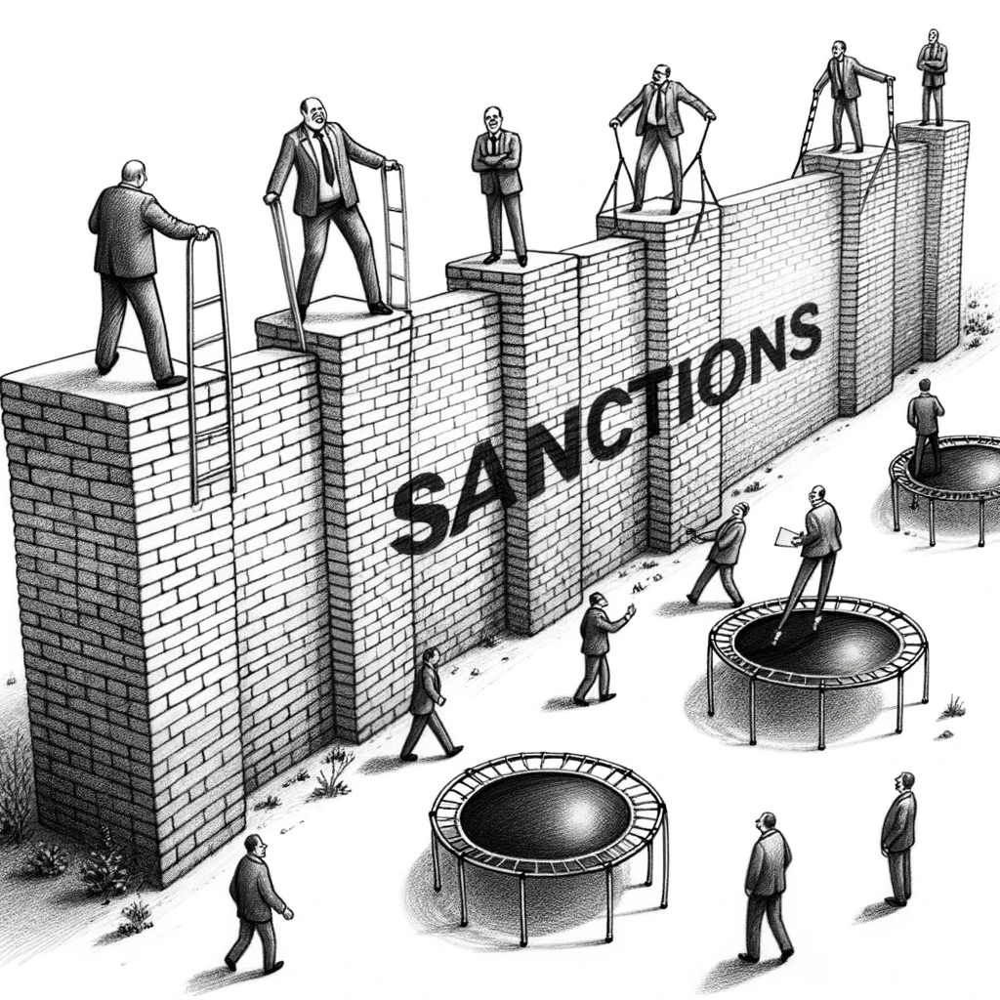
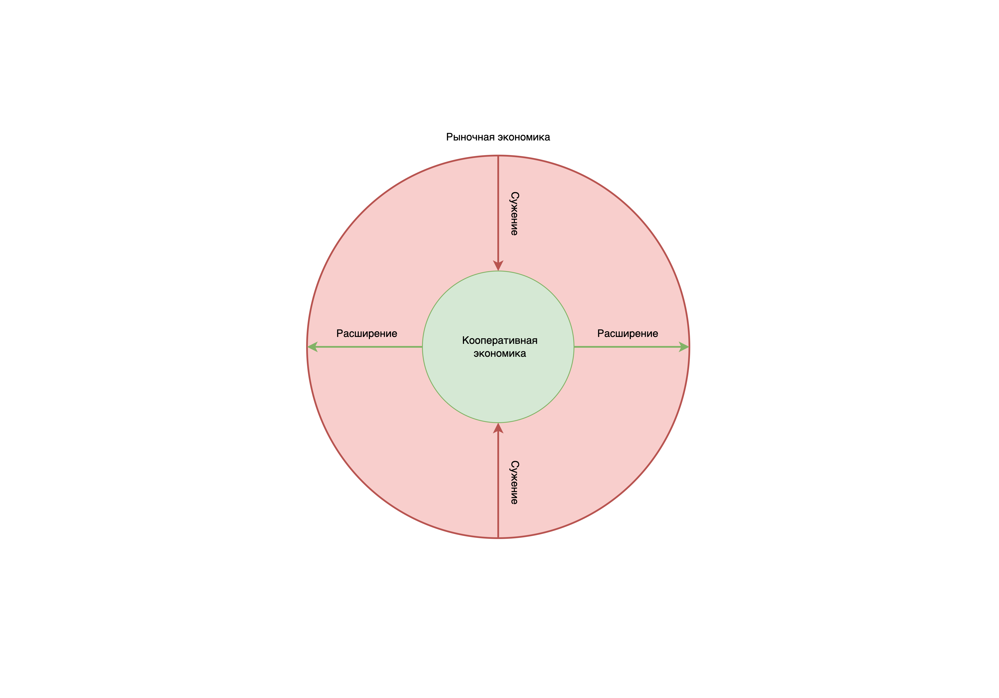

### Админстративная нагрузка

В современной экономике России предприниматели сталкиваются с множеством преград, которые замедляют развитие бизнеса и снижают эффективность деятельности. Одна из таких проблем – это огромная административная нагрузка. Чтобы запустить или поддерживать бизнес, предпринимателям необходимо получить массу разрешений, лицензий, согласований. Также им приходится уделять много времени и ресурсов на подключение к коммунальным услугам и составление различных отчетов. Примером могут служить сложные системы, такие как "Платон", регламенты для перевозок товаров и другие.

Особенно это становится заметно, когда рассматриваем малый и микробизнес. Согласно опросу, проведенному в 2022 году, для большинства предпринимателей затраты на выполнение всех этих административных обязательств составляют от 10 до 20% от их общей выручки. Это огромные деньги, которые могли бы быть инвестированы в развитие бизнеса, улучшение продукции или услуг, повышение зарплат сотрудникам.

Попытки государства уменьшить эту нагрузку, например, через принятие Закона о снижении административной нагрузки на малый и средний бизнес, к сожалению, не привели к значительным улучшениям.

Такая ситуация создает необходимость в новых подходах и решениях. Одним из потенциальных ответов на эти проблемы может стать развитие кооперативной экономики, где участники объединяются для совместной деятельности, минимизации затрат и упрощения административных процедур.

### Налоговая система

На текущий момент налоговая система России является весьма сложной и запутанной из-за многочисленных налогов, сборов и акцизов. Государство, кажется, ставит свои финансовые интересы на первое место, забывая о потребностях бизнеса.

При этом, не было проведено тщательного анализа, каким образом установленные ставки и система налогообложения будут влиять на экономику, на инвестирование и производство. Возьмем хотя бы такой налог, как НДС. В целом, налог, как таковой, не является проблемой, но его применение в текущем виде делает производство существенно менее выгодным. С каждым этапом производства, налоговая составляющая увеличивается, что делает конечный продукт менее конкурентоспособным.

Да, есть налоговые режимы, такие как УСН, которые не предлагают НДС. Однако они ограничены по многим параметрам. Если компания решает производить что-то более сложное или выходит за рамки установленных лимитов по обороту или численности сотрудников (например, серийное производство автомобилей, стиральных машин и даже простейших калькуляторов или большинство финансовых операций), то ей приходится осуществлять переход на Общую систему налогообложения, что сразу делает ее продукцию менее конкурентоспособной на рынке.

Таким образом, для поддержания конкурентоспособности российской экономики и стимулирования производства, налоговая система требует пересмотра и оптимизации.

### Кредитно-денежная политика

Казалось бы, инициативы, направленные на поддержку малого и среднего бизнеса через кредитование, должны были дать положительные результаты. Однако кредитно-денежная политика в РФ демонстрирует ряд противоречий.

Временное снижение ключевой ставки, введение льготных кредитов – всё это были шаги, которые, на первый взгляд, могли бы обеспечить поддержку и развитие бизнеса. Но на практике возникают противоречия: при снижении ставок, Центробанк повысил резервные требования к банкам. Это ограничило возможности банков по кредитованию реального сектора экономики в, казалось бы, благоприятных условиях.

Суть в том, что вместо того, чтобы финансировать перспективные проекты и инновации, банковская система ориентируется на залоговое обеспечение. А многие малые предприниматели просто не могут предоставить достаточное залоговое обеспечение.

Эта кредитная политика привела к тому, что вместо реальной поддержки экономики, банки ориентируются на приобретение активов по сниженной стоимости. С таким подходом банковское кредитование перестаёт быть инструментом экономического роста и становится, по сути, инструментом репрессий.

Важным моментом стали и валютные манипуляции, и недавнее экономически неоправданное увеличение ключевой ставки, которые привели к росту инфляции, усилению зависимости от азиатского импорта и усугубили экономическую ситуацию в стране. Отток капитала из страны достиг рекордных показателей, и задача создания стабильной экономической системы становится ещё сложнее.

Завершая этот раздел, стоит отметить, что причины, по которым кредитно-денежная политика не достигает своих целей, многогранны. От приверженности догмам МВФ до политической и личной ангажированности ответственных лиц – множество факторов влияют на экономическую ситуацию. Однако в любом случае, текущая кредитно-денежная политика России стоит на пути к экономическому росту, и требуется серьезный пересмотр подходов и стратегий в этом направлении.

   
   
   
   
<!--    
   
   
    ; - Конституция
    ; - Устав
    ; - Положение
    ; - Правила
    ; - Стандарты
    ; - Процедуры
    ; - Инструкции
    ; - Регламенты
    ; - Политики
    ; - Планы
    ; - Программы
    ; - Проекты
    ; - Стратегии
    ; - Тактики
    ; - Методики
    ; - Технологии
    ; - Инновации
    ; - Инвестиции
    ; - Финансы
    ; - Бюджет
    ; - Смета
    ; - Отчетность
    ; - Аудит
    ; - Контроль
    ; - Мониторинг
    ; - Оценка
    ; - Анализ
    ; - Планирование
    ; - Прогнозирование
    ; - Моделирование
    ; - Симуляция
    ; - Тестирование
    ; - Оптимизация
    ; - Автоматизация
    ; - Роботизация
    ; - Интеграция
    ; - Синтез
    ; - Агрегация
    ; - Децентрализация
    ; - Централизация
    ; - Глобализация
    ; - Локализация
    ; - Стандартизация
    ; - Нормализация
    ; - Легализация
    ; - Лицензирование
    ; - Сертификация
    ; - Аккредитация
    ; - Страхование
    ; - Гарантии
    ; - Компенсации
    ; - Санкции
    ; - Штрафы
    ; - Возмещение

Россия попала в изоляцию. Несколькими продвинутыми западными корпорациями формируется технологическое преимущество, в основе которого достижения в области Искусственного Интеллекта. Ещё 

а мы еще и не полностью вошли в предыдущий. Наше производство до сих пор основано на Советском наследии и остатках его тяжелой промышленности. Однако, сегодня сама жизнь , или погибнуть, как культура и единый народ в жерновах истории. 

Свобода — это возможность делать интересные вещи вместе с другими людьми. А этот сайт призван сделать шаг навстречу к Победе и создать правила игры в Кооперативную Экономику. 

Зачем нам подвиги? Чтобы вспоминать их, как подвиги своих дедов, как и наши деды вспоминали подвиги своих дедов, и так далее - сквозь связь поколений. Чтобы когда, наконец, на Земле воцарился Рай, мы помнили о том, какую цену мы за него заплатили. 

 -->

### Моральная экономика
Экономика без процентов и, соответственно, без кредита. В такой экономике нет места для традиционного "банкинга". 

### Кооперация в СССР
что в четыре раза превышало ассортимент плановой промышленности. Артели представляли 9% стоимости всей промышленной продукции и 80% товарного разнообразия (33444 наименования товаров - почти в 4 раза больше, чем плановая промышленность СССР). Так,  

Сегодня кооператив представляет собой автономную ассоциацию граждан, которые по собственной воле решают объединяться с целью удовлетворения своих экономических и социальных потребностей. В основе такого объединения лежат 5 принципов:

В период конца 19 – начала 20 веков Россия столкнулась с агрессивной капиталистической экономической моделью. Ответом на неё и в связи со Столыпинская реформой, обеспечивающей товарность сельского хозяйства, рационализацию землепользования и создание спроса на отечественное машиностроение, стали формы кооперации, такие как потребительская и производственная. Эти формы объединяли предпринимателей, акцентируя внимание на справедливости, этике и морали. К 1917 году число членов потребительской кооперации достигло впечатляющего показателя в 3 миллиона человек.

Основную часть этого числа составляли крестьяне. В деревнях действовало 16,5 тысяч кредитных кооперативов, 2,1 тысячи сельскохозяйственных товариществ, 6,1 тысячи сельскохозяйственных обществ и 3 тысячи маслодельных артелей.

История СССР также оставила нам уроки о важности кооперации. В период 1929-1955 гг. был создан экономический слой, включающий в себя колхозы, артели, кустарей и личные приусадебные хозяйства. Этот слой сыграл ключевую роль не только в обеспечении разнообразия товаров и услуг для широкого круга потребителей, но и создал спрос на продукцию отечетвенного машиностроения - основы индустриализации. Кооперативы компенсировали дефицит товаров, создаваемый плановой промышленностью. 

В целом, кооперативы представляли собой почти 80% товарного разнообразия, что в четыре раза превышало ассортимент плановой промышленности. Артели представляли 9% стоимости всей промышленной продукции и 80% товарного разнообразия (33444 наименования товаров - почти в 4 раза больше, чем плановая промышленность СССР). Так, кооперативы производили до 40% мебели, 70% металлической посуды и почти все детские игрушки. Примечательно, что первые советские бытовые приборы, такие как стиральные машины, телевизоры и холодильники, также были произведены кооперативами. 

Так, в СССР кооперативы представляли 9% стоимости всей промышленной продукции и 80% товарного разнообразия. Кооперативы производили до 40% мебели, 70% металлической посуды и почти все детские игрушки. Первые советские бытовые приборы, такие как стиральные машины, телевизоры и холодильники, также были произведены кооперативами.

В систему промысловой кооперации входило 100 конструкторских бюро, 22 экспериментальные лаборатории и 2 научно-исследовательских института. Колхозы и личные подсобные хозяйства (ЛПХ) к середине 1950-х по ключевым продовольственным позициям обеспечивали их основную долю в общей структуре сельскохозяйственного производства страны (ок.90%). Также широко были распространены кассы взаимопомощи, как при артелях, так и в колхозных хозяйствах.

Традиции, сложившиеся в России в докапиталистическую эпоху, а также опыт советского периода 1929-1953 годов, оставили неизгладимый след в современном правовом поле страны. Эти традиции, основанные на принципах качества, ответственности, экономии ресурсов, справедливости и солидарности, нашли свое отражение в законах о кооперативах.

Современное законодательство России о производственных кооперативах, зафиксированное в Федеральном законе 41-ФЗ от 8 мая 1996 года, а также законодательство о потребительской кооперации, принятое еще в 1992 году (Закон РФ 3085-1 от 19 июня 1992 года), объединяет в себе национальные ценности и принципы кооперативного движения Международного Кооперативного Альянса (МКА).

Особое внимание следует уделить одному из ключевых моментов законодательства – его целям. По закону, основной задачей потребительского кооператива не является извлечение прибыли. Главное направление его деятельности – это удовлетворение материальных и иных потребностей (включая духовные) его членов, пайщиков. Такой подход в корне отличается от классического капиталистического восприятия бизнеса и является отражением глубоко укорененных в российском обществе ценностей.

Именно этот акцент на социальную и духовную составляющую деятельности может служить одним из ответов на вопрос о возникновении в России такого явления, как прекариат. "Общество травмы", ищущее не просто материального благосостояния, но и глубокого социокультурного и духовного наполнения, обратилось к тем структурам, которые способны были бы удовлетворить его потребности на всех уровнях.

### Кооперативные инвестиции

<!-- А это, в свою очередь, стало одной из фундаментальных причин современной энтропии и кризиса мировой экономики.  -->

<!-- Фома Аквинский, выдающийся теолог, считал, что ссудный процент искажает природу денег как средства измерения стоимости, поскольку он придает деньгам стоимость, которая отличается от их номинала и зависит от времени.  -->

<!-- 
 -->

<!-- ### Отношение к ссудному проценту в истории и религии -->

<!-- ### Исламский взгляд на ссудный процент -->

<!--  -->

<!-- Великая значимость, придаваемая этой проблеме в Коране, становится ясной из суры "Корова". В этой главе Корана говорится о тех, кто берет и дает деньги под процент, сравнивая их с теми, кто находится под влиянием сатаны. Интересным моментом является то, что  -->

### Исламская экономическая доктрина и её особенности

Исламская экономическая ддоктрина отражает уникальное слияние моральных принципов и экономических практик. Этот феномен является частью более широкой концепции моральной или этичной экономики, где экономические решения принимаются с учетом и в соответствии с этическими нормами. В контексте исламской экономики эти нормы направлены на достижение социальной справедливости.

В этом "мире" моральной экономики, исламская экономика сталкивается с определенной напряженностью по отношению к современной неолиберальной экономической теории и практике. В то время как многие из традиционных экономических систем, таких как капитализм, фокусируются на максимизации прибыли, исламская экономика ставит акцент на соответствии торговым и финансовым операциям установленным религиозным принципам, в основе которого общественно полезный продукт и эквивалентный обмен.

Основатели современной исламской экономической модели стремились создать систему, которая могла бы предложить альтернативу традиционной капиталистической экономике и, в частности, традиционному банкингу. Отсюда и возникла идея о создании исламского банка, который бы сочетал в себе привычные структуры коммерческого банка с принципами шариата.

Однако в этой модели присутствует явное внутреннее противоречие. Пока традиционные банки основывают свою деятельность на предоставлении кредитов, исламский банк не может вести кредитную деятельность, так как это противоречит исламским принципам. Эта дихотомия, вероятно, стала причиной, по которой исламский банковский сектор не смог занять значимую долю на мировом финансовом рынке, несмотря на экономический потенциал многих исламских стран.

С момента создания первого исламского банка в 1963 году, исламский банковский сектор продолжает искать свою нишу в мировой экономике, сталкиваясь с различными препятствиями, включая упомянутое противоречие.

### Исламский банкинг и его место в глобальной экономике

Мировой финансовый рынок огромен и разнообразен, однако исламский сектор, несмотря на свою уникальность и особенности, составляет лишь малую долю от общего объема. Разбивая исламский финансовый рынок по секторам, можно выделить исламский банкинг, страхование "Такафул", облигации "сукук", другие исламские финансовые учреждения (OIFL) и исламские фонды.

Согласно данным "Форбс" за 2019 год, сумма всех финансовых активов мира оценивалась в 404,1 трлн долларов, где доля исламского сектора крайне незначительна - на нее приходится всего 3,16 триллиона долларов США (ок.0,8%). Исламский банкинг (1,992 трлн долларов США или 69% от мировых исламских финансов) составляет 6% в глобальных банковских активах, что свидетельствует о значительном прогрессе в этом направлении.

Однако этот рост, по всей видимости, был достигнут благодаря определенным компромиссам с исламскими ценностями в странах, таких как ОАЭ, Кувейт, Малайзия и Марокко. Это вызывает определенные опасения о том, насколько истинными остаются исламские банки в своем следовании традиционным принципам.

Следует также отметить, что в сравнении с исламским банкингом, попытки создать православные аналоги в настоящее время показали минимальные результаты.

Похоже, что российские законодатели, пытаясь внедрить исламский банкинг в своей стране, сталкиваются с аналогичными проблемами. Проект Федерального Закона РФ, направленный на создание условий для партнерского финансирования, пытается адаптировать исламские принципы к традиционным правовым рамкам, что, как предполагается, создает внутренние противоречия и делает их попытку обреченной.

В целом, это глава подчеркивает сложности и вызовы, с которыми сталкиваются страны и организации, пытаясь внедрить и адаптировать исламские финансовые практики в современном мире.

### Проблемы внедрения исламского банкинга в России

Центральный банк Российской Федерации, согласно законодательству, действует на основе ссудного процента, что является фундаментом функционирования кредитно-денежной системы страны. Это представляет собой традиционную модель финансирования, в которой проценты служат главным инструментом управления денежной массой и рефинансирования.

Однако, идущий вразрез с этой традиционной системой, проект федерального закона о внедрении эксперимента по "партнерскому финансированию" в некоторых регионах России предлагает отказ от ссудного процента. Этот экспериментальный подход направлен на внедрение исламских принципов финансирования, которые исключают учет процентов при предоставлении займов.

Тем не менее, анализируя структуру и содержание данного законопроекта, возникают определенные сомнения в его потенциальной успешности. Проект включает в себя ряд элементов из различных финансовых направлений, что делает его похожим на "лоскутное одеяло". Такое смешение понятий и условий, возможно, делает его сложным для понимания и реализации.

Более того, история России показывает, что попытки внедрения нестандартных финансовых систем, таких как "православный банкинг", могут закончиться неудачей и дискредитацией идеи в целом. Примеры таких неудач включают в себя ситуации с банком "Пересвет" и так называемым "православным" банкиром Пугачевым.

Следует также отметить, что авторы законопроекта избегают прямого упоминания термина "Исламский Банкинг", возможно, демонстрируя свою осторожность и стремление избежать прямой ассоциации с исламскими финансами.

Попытки внедрения исламского банкинга в России сталкиваются с рядом проблем, связанных как с законодательной базой, так и с описанной выше дихотомией и общественным восприятием и пониманием данной системы. Важно грамотно и осознанно подходить к этому процессу, чтобы избежать потенциальных ошибок и обеспечить успешное внедрение новой финансовой системы.

### Переосмысление банковской деятельности в контексте моральной экономики

В понимании большинства, банковская деятельность тесно связана с кредитованием и, следовательно, взиманием процентов. Суть этого процесса исходит из его определения: когда кредитор предоставляет денежные средства заемщику на определенных условиях, одним из которых является платность или взимание процентов.

Исторически, понятие "кредит" появилось в России в середине XIX века и было связано подготовкой и проведением реформы 1861 года. Если ссуды и займы предоставлялись, в основном, без начисления процентов (и это приветствовалось обществом, государством, религиозными конфессиями Российской Империи), то кредит по определению был процентным, что вызывало отторжение. Примером такого отношения служит образ старухи-процентщицы в романе Ф.М. Достоевского "Преступление и наказание", где она выступает в качестве воплощения аморальности.

Введение цифровых валют, таких как цифровой рубль, ставит под сомнение долгосрочное существование традиционных коммерческих банков. Эти технологии обещают революционизировать финансовую систему, делая традиционные банковские услуги менее востребованными. В этом контексте даже такие "альтернативные" институты, как исламские или православные банки, могут столкнуться с вызовами.

### Традиционные ценности против либерально-капиталистической идеологии

В мире, где цифровые технологии и глобальная экономика меняют социокультурную динамику, происходит борьба идеологий. С одной стороны, либерально-капиталистические ценности, основанные на корпоративной выгоде и индивидуализме, с другой – традиционные ценности, укорененные в религиозных учениях и культурном наследии.

Современные конфликты и экономические кризисы подогревают рост традиционных ценностей. Религиозные верования, такие как Ислам и Православие, предоставляют инструменты идеологической поддержки против насаждаемых либерально-капиталистических идеалов. Возрождение традиционных ценностей, в свою очередь, становится ответом на либерально-капиталистическую модель, в которой индивид оценивается по его экономической и политической пользе.

Центральной идеей этого возрождения является запрос на справедливость. Несмотря на разнообразие традиционных ценностей в различных слоях общества, справедливость становится общим знаменателем, противостоящим корпоративной логике, где люди рассматриваются как инструменты для получения прибыли.

<!-- ### Введение -->

<!-- Это новое, надгосударственное образование, будет способно поддерживать жизнь каждого участника в любой стране мира.  -->

<!-- что мы найдём способ кооперировать  -->

<!-- -->

<!-- Система перевернутого рынка загрузит плановую экономику и обеспечит всех - всем необходимым в своё время.  -->

<!-- Коммунизм станет не просто достижимым, он будет - в точности измерим.  -->

<!-- 
Прекариат не является монолитным классом. Это создает основу для их идентификации как отдельного класса, который ищет свой путь в современных условиях. 

А условия таковы, что 
 -->

<!-- Современный мир экономики и труда переживает радикальные изменения. Возникновение нового социального класса, известного как прекариат, стало следствием этих трансформаций. Слово "прекариат" произошло от латинского "precarious" — что-то ненадежное, неустойчивое. Вот именно такой жизнью обладает прекариат: нестабильной, непредсказуемой, полной неопределенностей.

В контексте российской действительности этот класс стоит особняком. 

 -->

<!-- Россия не является исключением из глобального тренда к росту прекариата. Напротив, благодаря особенностям экономической и социальной структуры, он занимает значительную часть рабочей силы. Теневая экономика, которая, по данным исследования 2017 года, составляет порядка 39% от ВВП страны, подпитывает прекариат, предоставляя ему "рабочие места". -->

### Американская Гегемония

С приходом IT-революции многие страны в мире столкнулись с новыми вызовами и возможностями. Используя доллар как экономическое оружие, США быстро ухватили инициативу в борьбе за доминирование и в новом надпространственном мире.

С момента появления интернета, США активно инвестировали в разработку и применение новых технологий. Google, Apple, Facebook и некоторые другие, быстро стали ведущими в своих отраслях, обеспечивая США контроль над основными информационными потоками в мире и используя как инструмент политического давления. Это видно, например, в экономических санкциях и ограничениях против определенных стран или компаний, а также во вмешательстве в цифровые коммуникации и информационные кампании.

С развитием современных цифровых технологий в мире, гегемония США постепенно ослабевает, что заставляет США использовать против конкурентов (прежде всего Китая) откровенно подрывные методы, таким образом нагнетая напряженность.

### Санкции и их воздействие на бизнес

Санкции стали еще одним испытанием для российской экономики и, в частности, для малого и среднего предпринимательства (МСП). Несмотря на активные действия Правительства РФ для минимизации их влияния, последствия для МСП оказались глубокими и многочисленными.

Одним из наиболее уязвимых секторов стала оптовая и розничная торговля, особенно в сфере непродовольственных товаров. Санкции прервали многие логистические цепочки и заблокировали доступ к многим из ключевых рынков. Это оказало существенное давление на предприятия, работающие в туриндустрии, недвижимости и строительстве.

Вкупе с противоречивой денежно-кредитной политикой, санкции также привели к снижению реальных доходов граждан. Это, в свою очередь, привело к снижению покупательной способности, что особенно сильно отразилось на ипотечном рынке. Падение спроса на ипотечные кредиты привело к снижению спроса на строительные материалы и услуги в этом секторе.

Однако, вопреки таким условиям, российская экономика постепенно адаптируется. Тем не менее, вместо ожидаемого кредитно-денежного стимулирования, результатом которого должно было стать активное импортозамещение, произошло замещение импорта - товары из Европы стали быстро замещаться азиатскими. К концу 2022 года это привело к значительному снижению платежного баланса, особенно учитывая уменьшение экспорта нефти и нефтепродуктов из-за закрытия рынков стран, которые ввели санкции против России. 

Таким образом, санкции не просто усилили давление на малый и средний бизнес, но и поставили перед экономикой России ряд серьезных вызовов, на преодоление которых потребуются объединенные усилия и новые стратегии развития.

### Недобросовестная конкуренция крупного бизнеса

Современный бизнес-ландшафт России столкнулся с еще одной проблемой, осложнившей ситуацию для малого и среднего предпринимательства. Сокращение спроса и уменьшение доходов крупных компаний привело к тому, что многие из них стали искать новые источники доходов. В результате их внимание обратилось к тем секторам, которые традиционно были заняты МСП.

Этот процесс не был мирным или добросовестным. Во многих случаях крупные компании, обладая значительными ресурсами, начали активно вытеснять малые и средние предприятия из ряда отраслей. Примером такого поведения может служить ситуация с ювелирной промышленностью, где крупные игроки попытались захватить долю рынка, ранее контролируемую МСП.

Но не только классический крупный бизнес стал угрозой для малых и средних предпринимателей. В ряде отраслей активизировались так называемые "мажоры" – продукт сплава интересов крупного бизнеса и государственных структур. Эти субъекты, пользуясь своим положением, без препятствий проникли в такие отрасли, как крабовое производство и часть рыболовной промышленности. Используя слабость и беззащитность МСП, "мажоры" не только успешно заняли их ниши, но и монополизировали их для себя.

## Некоммерческая Потребительская Кооперация как платформа

### Путь к этичной экономике в России

Моральные доктрины, такие как исламская и православная экономика, предоставляют основу для разработки экономических систем, в которых превалируют принципы справедливости, общественной ответственности и устойчивости. Удивительно, но эти принципы находят свое воплощение в потребительской кооперации, особенно в ее некоммерческой форме.

Справедливость: В обеих доктринах присутствует идея справедливого распределения доходов. В исламе это называется "закят", обязательное пожертвование на благо общества.

Безгарантийное вознаграждение: В моральной экономике вознаграждение за труд и инвестиции не гарантировано и определяется результатом усилий и вложений.

Общественный интерес: В центре внимания - общество и его благосостояние, а не частные интересы.

Противодействие односторонним преимуществам: И в исламе, и в православии осуждаются недобросовестные практики, которые приносят преимущества одной стороне в ущерб другой (гарар).

Общественное благо: Деятельность без создания общественного блага считается абсурдной (мейсир).

Отказ от ростовщичества: В обеих традициях осуждается практика ростовщичества или эксплуатация через чрезмерные проценты (риба).

Потребительская кооперация в России регулируется Законом о потребительской кооперации и Гражданским Кодексом РФ, обеспечивая свободное поле для развития внутренних социальных институтов, при условии соблюдения законодательства. Она также предоставляет основу для развития моральной и этичной экономики в России, создавая правовой и социальный фундамент для интеграции принципов этичной экономики в производственные и финансовые процессы.

Потребительская кооперация представляет собой инструмент для реализации социально-экономического потенциала российского прекариата, давая им возможность участвовать в экономике на равных и справедливых условиях.

### Коммерческая и некоммерческая кооперация

Когда мы говорим о потребительской кооперации, мы можем выделить два её формата: коммерческая и некоммерческая. 

Потребительский кооператив, который ведет свою деятельность с неограниченным кругом лиц на открытом рынке, не отличается от большинства коммерческих организаций. Он является полноценным субъектом коммерческой деятельности и подчиняется всем налоговым и административным требованиям, которые это предполагает.  

Однако, существует формат потребительского кооператива, который работает исключительно со своими участниками, или, как их еще называют, пайщиками. Этот формат подразумевает, что кооператив, как организация, взаимодействует только с ограниченным кругом пайщиков, и здесь - всё иначе. 

По сути, такой кооператив является некомерческой организацией. И ему предоставляются льготы, такие как освобождение от некоторых налоговых и административных обременений в соответствии с законодательством РФ (до 100%). И при этом, у некомерческих потребительских кооперативов нет ограничений на количество пайщиков в нем.

Некоммерческие потребительские кооперативы действуют как "внутренние офшоры". Это означает, что участники могут вносить свои активы в кооператив без страха их потери или необходимости выводить их за пределы страны для защиты. Активы, внесенные в качестве паевых взносов, защищены от любых взысканий по личным долгам или обязательствам пайщика. Это предоставляет участникам дополнительную уверенность в безопасности их взносов в кооператив и участия в его хозяйственной деятельности.

### Многофункциональность некоммерческих потребительских кооперативов

Некоммерческие потребительские кооперативы являются мощным инструментом в руках людей, желающих объединять свои ресурсы ради общих целей. 

На первый взгляд, одной из главных функций кооператива является сбор и концентрация ресурсов. Участники делают взносы, которые, в зависимости от договоренностей и правил кооператива, могут иметь различный характер - это безусловно возвратные паевые и членские взносы, имеющие широкий имущественный характер. Эти средства могут быть использованы для финансирования проектов и развития в самых разных областях - от сельского хозяйства и ритейла до технологий и здравоохранения.

Но функциональные возможности кооператива не ограничиваются этим. Он может стать платформой для совместного использования ресурсов. Например, участники могут объединять свои трудовые, интеллектуальные и материальные ресурсы для достижения общих целей. 

Кооператив может являться местом для организации сбыта товаров с условиями отсрочки оплаты и наценки, при этом обеспечивая полную прозрачность структуры конечной цены.

Если же говорить о предоставлении в пользование имущества, то кооператив может выступать в роли арендодателя, предоставляя своим участникам необходимые ресурсы.

И, наконец, кооператив может стать организацией, которая помогает своим участникам в решении срочных проблем, создавая кассы взаимопомощи. Подобные инициативы направлены на поддержку тех, кто столкнулся с непредвиденными трудностями.

Таким образом, некоммерческий потребительский кооператив представляет собой многофункциональный инструмент, который может быть адаптирован под конкретные потребности и задачи его участников.

### Платформа для кооперации в России

Потребительская кооперация в России предоставляет уникальную платформу для формирования морально-этичной экономики. В то время как большинство финансовых структур стремится к оптимизации своих операций в рамках современного банковского сектора, потребительские кооперативы предлагают альтернативный путь.

Вспоминая историю, в 19 веке российские предприниматели столкнулись с ростовщичеством и давлением банковской системы. Их ответом на это стало создание потребительских и производственных обществ, которые использовали свои валюты для собственных экономических операций, обойдя при этом банковскую систему. Примером такой практики может служить история "мальцевских денег" в ряде регионов России.

Современные кооперативы сохраняют этот дух инноваций, предлагая свою систему внутренних кооперативных денег. Этот инструмент, функционируя как клиринговый механизм, обеспечивает гладкое взаимодействие между участниками кооператива, избегая при этом налоговых и банковских сложностей.

Такой подход имеет потенциал для расширения за пределы кооператива. Эти внутренние кооперативные деньги могут стать вспомогательной валютой для российской экономики, уравновешивая и дополняя национальную валюту, особенно в контексте возможного перехода к "программируемому" цифровому рублю.

Верно, что потребительская кооперация не является полноценным заменителем всей экономической системы. Но она может служить важной частью российской экономики, особенно в секторе малого и среднего бизнеса, а также в потребительском секторе. Именно такое взаимодействие может стать ключом к созданию устойчивой и морально-этичной экономической структуры в России.

## Цифровизация как залог масштабирования моральной экономики

В основе некоммерческой потребительской кооперации (НПК), как формата моральной экономики, лежит общественный (общинный) принцип управления, характеризующийся равенством всех участников (один пайщик - один голос), выборностью управленческого звена, его подотчетностью собранию всех участников, коллегиальностью принятия решений. 

Согласно культурным, этичным и конфессиональным принципам, которые широко приняты в Российском обществе, а особенно среди людей с нестабильным положением (прекариата), такое общественное управление является воплощением справедливости. Однако чтобы поддерживать эту справедливость и доверие к управлению, необходимы четкие и понятные правила, которые все должны соблюдать при принятии любых решений.

И не только законы России требуют этих правил. Они нужны для того, чтобы все было понятно и честно в кооперативе для участников. Именно поэтому в кооперативах много документов и форм отчетности - тяжелый документооборот помогает сохранить доверие между участниками и делает работу кооператива возможной.

### Цифровая трансформация как ключ к справедливой экономике

Чтобы создать экономику, которая отвечает моральным стандартам и интересам тех, кто живет в нестабильных условиях в России, одним из ключевых инструментов становится цифровизация. Цифровые технологии выступают своего рода "клеем", который объединяет людей. 

Религиозные принципы Шариата или Православного христианства имеют свои консервативные моральные и этические ценности. Они регулируют множество аспектов жизни, включая экономику, и их основные правила очень похожи:

- Никаких процентов или дополнительных платежей за использование денег быть не должно.
- Доход должен приходить от реального бизнеса или инвестиций, где присутствует риск. 
- Финансирование вредных или "греховных" деятельностей недопустимо.
- Основной акцент делается на доход, полученный от реального труда — физического или умственного.
- Общее благо важнее, чем индивидуальные интересы каждого.

Цифровые технологии могут помочь внедрить эти принципы на практике, делая экономику более прозрачной, эффективной и справедливой.

### Роль блокчейна и смарт-контрактов в устойчивости кооперативной экономики

Технология распределенного реестра (блокчейн), вносит революционные изменения в управление и финансы кооперативной экономики. Они позволяют использовать математику для точного учета всех операций, гарантируют коллективное принятие решений и обеспечивает их надежное исполнение с помощью криптографии.

Смарт-контракты - это оцифрованные правила электронного документооборота кооперативов. Их невозможно подделать или как-то незаконно изменить. Это гарантирует устойчивость правил работы кооперативной экономики. 

Все это делает экономику не просто устойчивой, но и прозрачной, честной и справедливой для всех ее участников. Эта устойчивость и прозрачность особенно важны для будущего экономического развития России, делая ее менее уязвимой к различным рискам, включая атаки с целью дестабилизации.

### Цифровые технологии как инструменты эффективного управления и контроля

Эффективное управление требует не только экономической, но и ценностной экспертизы, а также строгого соблюдения этических норм. В этом контексте цифровые технологии представляют собой идеальный инструмент для обеспечения эффективности и надежности.

Цифровые решения упрощают тяжелую сторону управления кооперативов, автоматизируя многие процессы и сокращая административные издержки. Но их преимущества не ограничиваются этим. Благодаря технологии распределенного реестра и смарт-контрактам, управление становится не только более эффективным, но и полностью прозрачным для всех участников.

Таким образом, цифровые технологии не просто "технический" аспект управления; они становятся носителями и гарантом этичности и справедливости, что является крайне важным для создания устойчивой и процветающей моральной экономики. Эти инновации обеспечивают реальную возможность противостоять различным внешним угрозам, сохраняя при этом полную прозрачность и справедливость в отношении каждого участника.

### Шанс для России

В условиях быстро меняющегося мира и возрастающей цифровизации, Россия имеет все шансы стать одним из лидеров в развитии кооперативной экономики на основе современных технологий. Цифровая трансформация может стать катализатором для развития не только экономики в целом, но и для повышения уровня жизни каждого отдельного человека.

Создание устойчивой, прозрачной и эффективной системы будет способствовать формированию нового экономического порядка, в котором каждый участник является не просто "звеном в цепи", но полноценным и равноправным партнером. Такая система станет отражением наших лучших традиций и ценностей, и предложит альтернативу либеральному экономическому модели, в которой преобладают индивидуализм, стяжательство и жестокая конкуренция.

Цифровые технологии не просто инструменты, они — это ключевой элемент в создании справедливой и устойчивой экономики будущего для России.

_______________________

## Экономическая действительность
Как и любая информационная система, кооперативная экономика будет развиваться в 3 фазы - линейный, сложный рост, экспоненциальный, взрывной рост, и линейное затухание. 

Сегодня же развитие происходит на границе технологического разрыва информационной волны капитализма. Поэтому, мы можем сделать предположение, что кооперативная экономика является системой следующего порядка. 

Кооперативная экономика функционирует в мире свободных рынков. Мы не можем избежать касаний и не должны стремиться к этому. Напротив, мы должны стремиться к наращиванию площади контакта с рыночной экономикой, что приведёт к экспоненциальному росту кооперативной экономики ввиду её преимуществ для человека. 

Эта Победа откроет путь в новый технологических уклад и позволит создать прорыв, достойный наших предков. Этот прорыв будет заключаться в том, что мы первыми найдём способ соединения цифровых технологий и советского опыта кооперации в новой системе для жизни человека. 

## Новый социальный класс

После распада СССР в России возник новый социальный класс - **прекариат**. 

!!! tip "Прекариат (от lat. precarious - нанадежный, неусточивый) - это социальный класс людей с неустойчивым положением из-за временной, неформальной занятости без социальных гарантий и трудовых прав."

До 90-х годов трудящиеся могли рассчитывать на постоянство и предсказуемость трудовых отношений. Однако, в современном капиталистическом устройстве никаких гарантий нет. Его представители часто работают без официального трудоустройства, без социальных и медицинских гарантий, их доходы колеблются и зависят от множества переменных - могут быть, а могут и не быть.

Это означает, что многие россияне каждый день сталкиваются с рисками, связанными с нестабильностью занятости: неопределенностью доходов, отсутствием социальных гарантий и невозможностью планировать свою жизнь на долгосрочную перспективу. Такой образ жизни ведет к социальной напряженности, усилению чувства несправедливости и разобщенности.

<!--  -->

Представители прекариата могут иметь разный уровень образования, квалификации, жизненного опыта. Однако их объединяет общая черта — отсутствие стабильности и перспектив в профессиональной и социальной жизни. 

По данным исследования 2017 года, теневая экономика, которая является сектором обеспечения жизни прекариата, составляет порядка 39% от ВВП страны. Т.е. почти половина продуктов России производится или потребляется прекариатом. 

В решении проблемы роста качества жизни прекариата через его участие в общественной жизни страны лежит ключ к восстановлению былого величия. Те люди, кто сегодня не обладает стабильной жизнью, должны найти способ с помощью новых цифровых технологий и советского опыта кооперации создать среду, в которой свободный рынок проиграет их единству. 

## Теневая экономика

Теневая экономика, нередко называемая "нелегальной" или "невидимой", занимает центральное место в жизни прекариата. Это обширная сфера экономической деятельности, которая обходится стороной официального учета, налогообложения и государственного регулирования. И хотя теневая экономика встречается практически во всех странах мира, в России она приобретает особую масштабность и роль.

Одной из главных особенностей теневой экономики является ее разнообразие. Она может включать в себя все: от простых домашних работ, таких как ремонт или садоводство, до сложных производственных процессов и крупных предприятий. Однако, несмотря на разнообразие форм и масштабов, все эти виды деятельности объединяет одно – формальное наличие или вовсе отсутствие официальной регистрации и налогообложения.

Теневая экономика предоставляет прекариату возможность заработка. Вместе с тем она приносит ряд проблем и рисков: нестабильный доход, отсутствие социальных гарантий, риск попасть под санкции со стороны государства. В некотором роде, участие в теневой экономике – это обоюдоострый меч для представителей прекариата.

Важно понимать, что за рамками официальной статистики остается значительная часть экономической деятельности. И это не только производство товаров и услуг, но и деятельность, связанная с их потреблением. В российском контексте это может быть, например, производство в личных подсобных хозяйствах или домашнее производство для собственного потребления.

Однако, несмотря на все трудности и риски, теневая экономика остается для многих единственным способом обеспечить себе и своим близким достойное существование. Это подчеркивает сложность и многогранность проблемы, требующей комплексного и деликатного подхода со стороны государства и общества.

Прекариат, находясь на периферии официальной экономики, вынужден искать способы самоорганизации, чтобы обеспечивать себе существование. В своей сути, это класс людей, которые оказались в ситуации экономической неопределенности и нестабильности. Все это вынуждает их адаптироваться, создавая собственные, часто неформальные, экономические механизмы.

Одним из ярких проявлений автономности прекариата в экономическом плане является его предпринимательская активность. Интересно, что финансирование этой деятельности зачастую происходит не через банковскую систему. Вместо этого прекариат прибегает к собственным ресурсам, займам у друзей, родственников или к поддержке этнических и культурных диаспор.

Такое положение вещей подчеркивает важный момент: прекариат не просто пассивно принимает обстоятельства, он активно реагирует на них. При этом в ответ на экономические и социальные трудности формируются новые принципы деятельности, основанные на личном опыте, культурных и этнических традициях, а также на внутренних моральных установках.

Однако, вопреки всем стараниям и адаптациям, прекариат остается в уязвимом положении. Отсутствие официального признания и поддержки со стороны государства делает его деятельность рискованной и нестабильной. Таким образом, прекариат, сталкиваясь с системными преградами, вынужден постоянно балансировать между желанием сохранить экономическую активность и необходимостью избегать возможных проблем.

В целом, этот слой населения показывает, насколько важна адаптивность и гибкость в условиях современной экономической реальности. Однако без соответствующих мер поддержки и интеграции со стороны государства и общества их потенциал может остаться нереализованным, либо, что еще хуже, направляется в деструктивное русло.

Треть всех российских компаний понесла убытки из-за пандемии, а численность прекариата возросла из-за закрытия миллиона предприятий. Всего от кризиса пострадали более 6 миллионов компаний и предпринимателей. Это почти ⅔ всех предприятий страны.

Ситуация в 2021 году стала еще хуже. За этот год закрылось 1,16 миллиона предприятий малого и среднего бизнеса, что в 2,3 раза больше, чем в предыдущем году. Большинство из них, а именно 62%, не имели финансового запаса для поддержания своего бизнеса в условиях кризиса. Эта ситуация вынудила многих сокращать расходы или вовсе закрывать свои дела.

В 2022 году наблюдалась аналогичная тенденция: количество закрытых предприятий превысило количество новых на 38,1 тысячи, или на 13,6%.

Таким образом, пандемия коронавируса стала настоящей катастрофой для малого и среднего бизнеса в России, усиливая экономическую нестабильность и расширяя класс прекариата. 

## Экономика потребления

Динамика развития спроса на свободном рынке носит характер логистической кривой и состоит из трех основных частей:
- Линейное начало, когда спрос на продукт мал и растёт линейно;
- Экспоненциальный рост, когда српос на продукт растёт экспоненциально;
- Линейное затухание, когда спрос на продукт линейно снижается. 

Затем, возникает технологический разрыв, и появляется новая логистическая кривая точно такого же характера. Те компании, которые поймают эту волну развития - вновь будут получать прибыль, а те, которые пропустят её - обанкротятся. 

Мы знаем множество примеров, когда крупные компании, обладающие лидерством в одной такой волне, безвозвратно теряли своё лидерство в другой. Так, компания Kodak, лидер на рынке фотопленки, не смогла адаптироваться к эпохе цифровых технологий, а Nokia не удержала лидерские позиции на рынке мобильных телефонов с появлением смартфонов. 

Проблема перепроизводства заключается в том, что компании не знают наверняка какой будет спрос на их продукцию, и создают её избыток, в то время, когда нужно было менять волну. Их инвестиционные прогнозы строятся на прошлом, в предположении, что если рынок растёт сейчас, то он и будет расти. Однако, когда у рынка начинаются проблемы, проблемы начинаются у всех. 

### Деньги как товар
Виртуальные рынки оторваны от реальности. В реальном мире экономика строится вокруг людей и их договеренностей. Люди договариваются о чём то и входят в отношения, в ходе развития которых, стороны исполняют свои обязательства. 

Например, люди заключают договор поставки чего-то в обмен на что-то. И такой договор - это основа здоровой экономической системы. Потому что когда такие договора заключается, и их количество растёт - это свидетельствует о том, что у людей всё хорошо. И людям совершенно не важно сколько сегодня стоит виртуальный торговый инструмент. 

Однако, как мы знаем по опыту 90-х годов, в свободной рыночной экономике положительного ссудного процента допустима и часто встречается кризисная ситуация, при которой производственные мощности и временные ресурсы людей есть, а денег, для того чтобы сделки заключались - нет. Причиной этому парадоксу является то, что деньги являются точно таким же товаром, который торгуется на свободных рынках. 

И так само-собой получается, что в системе взаимоотношений между людьми существует элемент, который не является необходимым. Людям нужны результаты их договоров с другими людьми, а в результате, у них в руках оказываются деньги, которые являются товаром со свободной ценой, из-за которого случаются кризисы и теряется всё. 

Людям нужен эквивалент стоимости для того, чтобы совершать сделки, а товар, которым они пользуются в качестве посредника, регулярно приводит их к проблеме кризиса. Главная проблема, с которой сталкиваются люди в любой кризис - это отсутствие этих самых денег.

В экономике положительного ссудного процента эмиссия денег никак не связана с количеством сделок, которые реально совершают люди - они находятся в разных мирах. 

### Деньги как эквивалент
Для того, чтобы назначать стоимость товаров и услуг, людям необходим универсальный эквивалент. Сегодня эту роль выполняют деньги, которые, одновременно с этим, являются и товаром - т.е. могут покупаться и продаваться относительно других денег. 

В то время как марксистская политическая экономия рассматривает деньги прежде всего как товар, кооперативная экономика подходят к ним как к служебному инструменту, созданному для удовлетворения хозяйственных потребностей общества. 

В кооперативной экономике деньги не имеют товарных свойств в полном смысле этого слова, главным образом потому, что их нельзя купить и продать за другие деньги на свободном рынке. В кооперативной экономике нет свободных рынков для торговли деньгами. 

Которую, как мы определили ранее, необходимо измерять смыслом знаний. Знания же определяются количеством практических применений форм, содержаний и поведений явлений нашей оцифрованной Вселенной, или, актов действий с ними. 

Основываясь на принципах сотрудничества и коллективного использования ресурсов, эта модель экономики стремится к оптимизации и максимальной эффективности хозяйственного процесса. В ее основе лежит идея равенства и справедливого распределения как ресурсов, так и ответственности между всеми участниками. 

Основы кооперации восходят к самым ранним стадиям человеческого общества, когда кооперативные принципы организации взаимопомощи и общности интересов были первичными формами экономической деятельности, предшествующими изобретению денег. 

Объединяясь для совместной охоты, сельскохозяйственных работ или строительства жилищ, а затем и для развития торговли, люди стремились удовлетворять свои потребности через общий труд и распределение ресурсов. 

Однако, 

Эти ранние формы кооперации легли в основу формирования кооперативных движений различных эпох и культур по всему миру. 

_______________

# Волновой план

## Информационная волна 

## Линия жизни

## Технологический разрыв

## Фазовый переход

## Сферы жизни

## Книга жизни

## Коллективный Разум

_______________

В корне современной экономической системы лежит практика займов под положительный ссудный процент, где вознаграждение кредитору за пользование его деньгами фиксировано в процентной ставке. 

Деньги, предоставленные в качестве займа, приносят доход без учета реальных хозяйственных изменений и предпринимательских рисков. Однако, в предпринимательстве, где инвестированный капитал может приносить как прибыль, так и убыток, риск является неотъемлемой частью процесса производства выгоды. 

    ### Кооперативные контракты
        #### Поставка-приобретение
        #### 

## Кооперативные смарт-контракты

    
    ### Децентрализация и управление
    
    ### Экономика знаний
    
    ### Кообщество
    
    ### Род
    
    ### Семья

Технология распределенного реестра (блокчейн), вносит революционные изменения в управление и финансы кооперативной экономики. Они позволяют использовать математику для точного учета всех операций, гарантируют коллективное принятие решений и обеспечивает их надежное исполнение с помощью криптографии.

Смарт-контракты - это оцифрованные правила электронного документооборота кооперативов. Их невозможно подделать или как-то незаконно изменить. Это гарантирует устойчивость правил работы кооперативной экономики. 

Все это делает экономику не просто устойчивой, но и прозрачной, честной и справедливой для всех ее участников. Эта устойчивость и прозрачность особенно важны для будущего экономического развития России, делая ее менее уязвимой к различным рискам, включая атаки с целью дестабилизации.
